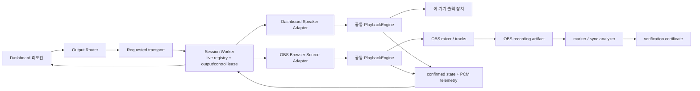

# Rekasong 스피커·OBS 출력 및 송출 검증 마스터 계획

> 작성일: 2026-07-19
> 작업 위치: `D:\Agents\rekasong\Codex\workspace`
> 상태: Protocol/Worker/공통 재생 기반 구현 완료 · Dashboard 출력 선택 UI와 실제 OBS 증명 대기
> 적용 범위: 대시보드 리모컨, 스피커 재생, OBS Browser Source 재생, 세션 Worker, OBS 녹화·stream output 및 카라오케 싱크 검증

## 0. 문서의 역할

이 문서는 앞으로 진행할 **오디오 출력 제품화 작업의 기준 문서**다.

- `MASTER_EXECUTION_PLAN_2026-07-19.md`의 전체 프로젝트 계획 중 오디오 출력과 OBS 검증 부분을 구체화한다.
- `OBS_TEST_PLAN.md`의 증거 단계와 수치 기준을 계승한다.
- `OBS_MANUAL_ACCEPTANCE_RUNBOOK_2026-07-19.md`는 실제 OBS에서 증거를 채취하는 실행 절차다.
- `IMPLEMENTATION_LOG_2026-07-19.md`는 이 계획 대비 현재 코드·자동 검증 체크포인트다.
- `I18N_IMPLEMENTATION_PLAN_2026-07-19.md`는 모든 사용자 문구를 번역 가능한 구조로 옮기는 별도 실행 계획이다.
- `OBS_VERIFICATION_2026-07-18.md`에서 확인된 미검증 사항을 구현 과제로 전환한다.
- 기존 문서는 조사 기록으로 남기되, 스피커/OBS 출력 기능과 송출 인증의 상세 판단은 이 문서를 우선한다.
- 구현 중 요구나 관측 결과가 바뀌면 코드보다 먼저 이 문서의 결정·합격 기준을 갱신한다.

### 0.1 2026-07-19 구현 체크포인트

현재 다음 기반은 `Codex/workspace`에 구현되어 있다.

- Protocol v2의 control/player identity, 단일 출력 lease, speaker/OBS 후보 분리, route/run/test 상호 배제, 강한 STOP·emergency postcondition
- Worker의 durable command/event 결과, authoritative/telemetry namespace 분리, heartbeat liveness, `activeFamily`·`activeCheckId` snapshot
- 공통 `PlaybackEngine`, 전체 Blob source resolver, OBS runtime attestation, 결정적 PCM pulse fixture
- speaker/OBS별 후보·전환 gate·검증 scope를 순수 상태로 계산하는 output view
- 출력 전환을 명시적 transaction으로 다루는 control coordinator 기반
- OBS 출력 관련 semantic copy key와 한국어 fallback 카탈로그
- Widget의 v2 명시 opt-in과 lazy-loaded v2 player chunk

아직 다음 항목은 완료가 아니다.

- Dashboard에서 legacy control과 v2 control을 완전히 상호 배제한 실제 출력 selector·speaker player 연결
- 테스트 신호 진행 상태, OBS 로컬 무음 설명, 요청/확정/최종 검증을 보여주는 제품 UI
- 실제 OBS CEF, mixer, 녹화 파일, test stream artifact, 마이크↔MR 싱크 증거
- production Worker/프런트 배포와 canary. 배포할 때는 새 snapshot 필드를 제공하는 Worker를 먼저 배포한다.

이 문서에서 `확인`, `검증`, `인증`, `보장`은 같은 뜻이 아니다.

- **확인**: 한 계층의 상태나 신호를 관찰했다.
- **검증**: 미리 정한 절차와 합격 기준을 통과했다.
- **인증**: 특정 설정 fingerprint에 대해 검증 결과를 저장했다.
- **보장**: 정의된 환경·오차 범위·유효 기간을 명시할 수 있을 때만 사용한다.

## 1. 최종 제품 결론

### 1.1 사용자가 고르는 것은 음소거가 아니라 출력 위치다

리모컨에는 항상 보이는 두 가지 오디오 출력 모드를 둔다.

1. `스피커 · 이 기기에서 듣기`
2. `OBS · 방송으로 송출`

둘은 동시에 재생 권한을 받지 않는다. 같은 재생 엔진 계약을 두 위치에서 실행하되, 세션 Worker가 발급한 **단 하나의 활성 출력 lease**를 가진 플레이어만 재생할 수 있다. 단, 연결이 끊긴 기존 player가 계속 audible한지는 서버가 단정할 수 없으므로 정지 ACK가 없으면 새 출력을 시작하지 않고 `audio unknown`으로 막는다.

### 1.2 첫 사용 기본값은 스피커다

- 음악 감상은 OBS 설치나 세션 설정 없이 자연스럽게 시작할 수 있어야 한다.
- 마지막 출력 선택은 이 브라우저에 저장하되, OBS 모드를 복원한 경우 자동 재생하지 않는다.
- OBS 실패를 스피커로 자동 전환하지 않는다. 방송 중 로컬 스피커가 갑자기 울리는 것도 사고다.

### 1.3 OBS 모드에서 로컬 무음은 정상이며 항상 설명한다

OBS 모드의 현재 재생 패널에는 다음 문구가 접히지 않은 상태로 항상 보여야 한다.

> OBS 플레이어에서 재생합니다. 이 기기의 스피커가 무음인 것은 정상입니다.

로컬에서 같은 곡을 복제해 모니터링하는 기능은 제공하지 않는다. 두 미디어 시계가 생기면 echo와 착각, 서로 다른 seek 결과를 만들 수 있다. 스트리머의 청취는 OBS의 Audio Monitoring과 헤드폰 경로를 안내한다.

### 1.4 리모컨은 요청과 실제 동작을 분리해 보여준다

- 버튼을 누른 상태: `OBS에 재생 요청 중…`
- 활성 플레이어가 실제 `playing`을 보고한 상태: `OBS 플레이어에서 재생 확인`
- 실제 PCM이 검출된 상태: `플레이어 오디오 신호 있음`
- OBS mixer가 해당 신호를 받은 상태: `OBS 믹서 확인`
- OBS 녹화 파일에서 신호를 검출한 상태: `OBS 녹화 확인 완료`
- test stream의 ingest/VOD artifact에서 신호를 검출한 상태: `OBS 송출 확인 완료`
- 마이크와 MR의 상대 오차·드리프트까지 합격한 상태: `카라오케 싱크 확인 완료`

아래 계층의 증거로 위 계층을 추정하지 않는다.

### 1.5 재생 중 출력 hot handoff는 약속하지 않는다

노래 중간에 스피커 clock과 OBS CEF clock 사이를 이어 붙이는 것은 카라오케 싱크에 안전하지 않다.

- 정지 상태: 즉시 전환한다.
- 일시정지 상태: 위치를 보존해 새 출력에 로드하되, 자동 재생하지 않는다.
- 재생 상태: `다음 곡부터 전환`을 기본 행동으로 제안한다.
- 사용자가 즉시 전환을 원하면 `현재 곡을 멈추고 처음부터 전환`하거나 취소한다.
- 중간 위치에서 자동 재개하는 기능은 별도 실험과 실제 OBS 합격 전에는 제공하지 않는다.

## 2. 성공 기준

완성된 제품에서는 처음 보는 사용자가 5초 안에 다음 질문에 답할 수 있어야 한다.

1. 지금 소리는 이 기기와 OBS 중 어디에서 재생되는가?
2. OBS 모드에서 이 기기 스피커가 무음인 이유는 무엇인가?
3. 내가 누른 재생·일시정지·seek·볼륨 명령을 활성 플레이어가 실제 수행했는가?
4. 플레이어 연결, 내부 PCM, OBS mixer, 녹화, 실제 stream output, 카라오케 싱크 중 어디까지 검증됐는가?

기술적으로는 다음 불변 조건을 만족해야 한다.

- 같은 세션에서 **재생을 허가받은** active player는 항상 0개 또는 1개다.
- 이전 player의 pause/source-detach ACK가 없는 동안 실제 audible 수는 `unknown`이며 새 player를 허가하지 않는다.
- 중복은 현재 선택 모드에서 출력 자격이 있는 live candidate가 2개 이상인 상태다. speaker 1개와 OBS 1개가 standby로 함께 연결된 것은 정상이다.
- stale run, 이전 lease, 다른 player의 이벤트가 현재 곡 상태를 변경하는 횟수는 0이다.
- 정상 전환에서 두 플레이어의 확인된 동시 재생 구간은 0ms다. 연결 손실로 확인할 수 없으면 합격 처리하지 않는다.
- Dashboard와 활성 플레이어의 마지막 확인된 media time 오차는 정상 네트워크에서 p95 250ms 이하다.
- 빠른 점검 신호의 marker 누락·중복은 0이다.
- 최종 녹화에서 clipping 0, 활성 구간 dropout 20ms 초과 0을 목표로 한다.
- 보정 후 마이크↔MR 고정 오프셋은 ±20ms 이내다.
- 한 곡(최대 5분) 상대 drift는 10ms 이내, marker interval/offset jitter p95는 5ms 이하다. 10분 결과는 stress 진단이며 route gate가 아니다.

## 3. 착수 당시 확인된 기준선

> 이 절은 문제를 발견했을 당시의 기록이다. 현재 해소 여부는 0.1절과 `IMPLEMENTATION_LOG_2026-07-19.md`를 우선한다.

### 3.1 출력 경로

현재 프로덕션에는 런타임 출력 선택이 없다.

- `src/pages/Dashboard.jsx:95-98`의 `useOnAirPlayer = onAir.configured` 때문에 `VITE_ON_AIR_BASE_URL`이 있는 빌드는 항상 원격 player 경로를 사용한다.
- 숨은 로컬 `<audio>/<video>`는 `Dashboard.jsx:1343`, `1460-1495`에서 로컬 파일 direct mode에만 쓰인다.
- 준비된 YouTube 오디오는 `src/lib/preparePipeline.js:8-17`의 정책 때문에 세션 없는 direct path에서 재생하지 않는다.
- 프로덕션에서도 스피커 모드가 같은 session/player token으로 준비 오디오를 받아야 두 모드의 동작이 동일해진다.

### 3.2 상태 표현

- `src/components/PlaybackPanel.jsx:160-164`의 막대는 PCM이 아니라 `isPlaying` Boolean으로 움직이는 장식이다.
- `PlaybackPanel.jsx:294-297`은 generic player presence를 `OBS 플레이어 연결됨`이라고 표시한다.
- `Dashboard.jsx:205-224`는 원격 seek가 확인되기 전에 위치를 낙관적으로 바꾼다.
- `Dashboard.jsx:1303-1305`는 remote `loading`과 `buffering`도 `isPlaying=true`로 처리한다.
- 단일 `volume`이 `Dashboard.jsx:103-146`에서 로컬 감상과 방송 gain에 함께 사용될 수 있다.

### 3.3 원격 프로토콜

- `src/hooks/useOnAirSession.js`의 presence는 player/display Boolean뿐이다.
- `workers/rekasong-session/src/index.js:380-404`는 명령을 모든 player에 보내고 현재 `sessionId`만 맞으면 어느 player의 이벤트든 수용한다.
- player instance, 곡 재생 시도별 `runId`, 출력 lease 세대가 없다.
- Worker가 명령을 받은 즉시 transport를 낙관적으로 변경하고, socket close를 실제 pause로 단정한다.
- 같은 player URL을 OBS 소스 두 개 또는 OBS와 일반 브라우저에서 열면 이중 재생 위험이 있다.

### 3.4 미디어 준비와 싱크

- 작업 시작 전 legacy `src/components/OnAirPlayer.jsx`는 다음 최대 2곡을 완전 다운로드한 Blob으로 prefetch했고 첫 곡이나 miss는 원격 URL streaming으로 시작했다.
- 현재 legacy rollback 경로는 다음 곡 1개·`64MiB`로 제한하고 stale fetch를 abort한다. 첫 곡/miss streaming 특성은 남아 있으므로 `모든 legacy 곡을 재생 전에 완전 수신`이라고 설명하지 않는다.
- 현재 OBS v2 경로는 direct LOAD와 PREFETCH를 각각 `64MiB`로 제한하고 완전히 materialize된 Blob만 PlaybackEngine에 건넨다. active+prefetch retained 상한은 `128MiB`다.
- `backend/prepare_worker.py`는 원본 m4a/webm/ogg/mp3를 그대로 사용할 수 있어 sample rate, codec, encoder priming이 곡마다 다를 수 있다.
- Chromium smoke는 브라우저 media time만 검사하며 실제 OBS CEF, mixer, 녹화 PCM, mic sync는 검사하지 않는다.

### 3.5 2026-07-19 프로덕션 UI 실측

실제 `https://11qaws.github.io/rekasong/`를 데스크톱과 390×844 viewport에서 점검했다.

- 현재 재생 패널에는 출력 모드가 없고 우측 상단의 `OBS 연결 설정` 톱니만 있다.
- 설정 modal은 `브라우저 소스 2개를 추가하면 끝`이라고 안내하지만 오디오 player와 선택적 display의 중요도를 구분하지 않는다.
- `Local file` 해제는 안내하지만 `Control audio via OBS` 체크는 안내하지 않는다.
- 초록 상태는 실제 OBS가 아니라 generic player page presence다.
- 모바일 modal은 내부 scroll이 가능하지만, 열 때 focus가 modal로 이동하지 않았다.
- focus trap, Escape 닫기, 닫은 뒤 trigger focus 복원, 점검 중 backdrop 오클릭 방지가 확인되지 않았다.
- `index.html:2`의 언어가 실제 한국어 UI와 달리 `lang="en"`이다.

### 3.6 개발·검증 환경

- 사용자가 띄운 local Dashboard는 `http://127.0.0.1:5000/`이다.
- production 연결 경로는 이번 계획 작성 전에 production Worker/prepare 경로로 복구됐다.
- 기능 개발과 test tone은 local 및 격리 staging에서 먼저 수행한다.
- staging Worker, R2 fixture, token, OBS test profile은 production과 분리한다.
- production에서는 G0~G3 통과 전 실제 곡이나 test tone을 이용한 파괴적 검증을 하지 않고 read-only health/smoke만 수행한다.
- 실제 OBS 자동화는 test profile/scene collection에서 실행하고 사용자의 방송 profile을 자동 변경하지 않는다.

## 4. 제품 원칙과 비목표

### 4.1 원칙

1. **차단 실패**: 확신할 수 없으면 다른 출력을 자동 재생하지 않는다. 실제 무음을 확인하지 못했으면 `무음`이라고 단정하지 않는다.
2. **단일 출력권**: player presence와 재생 권한을 분리한다.
3. **같은 엔진**: 스피커와 OBS에 동일한 미디어 명령·상태·측정 코드를 쓴다.
4. **요청과 확정 분리**: UI는 사용자의 의도와 실제 player 상태를 함께 보인다.
5. **증거의 정직성**: PCM meter를 최종 방송 meter라고 부르지 않는다.
6. **설정 1회, 빠른 재확인**: 장비 설정 인증과 세션별 pairing 점검을 분리한다.
7. **현재 곡 보호**: 네트워크 순단이나 소스 refresh가 새 player의 자동 재생으로 이어지지 않는다.
8. **수동 우회도 명시적**: 안전 게이트를 건너뛸 때 원인·시간을 화면과 로그에 남긴다.

### 4.2 이번 범위의 비목표

- 스피커와 OBS의 동시 재생 또는 앱 자체 로컬 monitor
- 재생 중 무중단 clock handoff
- 인터넷을 통한 OBS websocket 비밀번호 보관·중계
- OBS mixer 확인 없이 `송출 정상`이라고 자동 판정
- 실제 장비 측정 없이 절대적인 무지연 보장
- 상업용 YouTube 영상 ID에 의존하는 CI fixture
- 첫 구현에서 자동 OBS sync offset 변경

## 5. 사용자 흐름

### 5.1 음악 감상 사용자

1. 앱을 연다.
2. 기본 출력 `스피커 · 이 기기에서 듣기`를 확인한다.
3. 브라우저 autoplay가 막히면 `소리 재생 허용`을 한 번 누른다.
4. 곡을 선택하고 같은 리모컨으로 play/pause/seek/volume/next를 쓴다.
5. 지원 환경에서는 `출력 장치`에서 기본 스피커·헤드폰 등을 고를 수 있다.
6. OBS 설정은 요구하지 않는다.

### 5.2 첫 OBS 설정 사용자

1. 출력 선택기에서 `OBS · 방송으로 송출`을 고른다.
2. 앱이 첫 설정 wizard를 열고 현재 단계와 전체 단계를 표시한다.
3. 필수 오디오 player Browser Source와 선택 display source를 구분한다.
4. `Local file` 해제, `Control audio via OBS` 체크, source lifecycle 설정을 확인한다.
5. OBS runtime attestation과 player 단일 연결을 확인한다.
6. 빠른 고정 PCM을 재생해 player 내부 PCM과 OBS mixer pulse를 확인한다.
7. 10초 test recording을 분석해 OBS 녹화 경로를 검증한다.
8. 방송 플랫폼의 test stream/VOD를 사용할 수 있으면 실제 streaming output도 별도 확인한다.
9. 노래 방송 사용자는 별도의 10분 mic↔MR/monitor sync 인증을 수행한다.
10. 설정 fingerprint와 통과 계층을 저장한다.

### 5.3 반복 방송 사용자

1. 이전 선택과 인증 요약을 확인한다.
2. 앱 build·protocol·fixture·OBS 설정 fingerprint가 같으면 긴 인증을 반복하지 않는다.
3. 현재 player URL이 session token 기반인 동안에는 세션별 8초 빠른 pairing 점검을 한다.
4. `OBS 플레이어에서 재생 확인`, 실제 시간, player PCM, 마지막 telemetry age를 상시 본다.
5. 필요할 때 `다시 점검`으로 전체 인증을 재실행한다.

### 5.4 장애 사용자

- player 없음: 곡을 재생하지 않고 `OBS 설정 열기`와 `스피커로 듣기`를 제안한다.
- player 중복: 하나만 남길 때까지 OBS 재생을 차단한다.
- control socket 단절: 실제 media가 계속될 수 있으므로 `일시정지됨`이라 단정하지 않고 `출력 상태 알 수 없음`을 표시한다.
- player는 재생이지만 PCM 0: 음원·decoding·player gain 문제로 분류한다.
- PCM은 있지만 OBS mixer 미확인: OBS source 설정·mute·track 문제로 분류한다.
- OBS mixer는 있지만 녹화에 없음: track routing/output 설정 문제로 분류한다.
- 인증 중 이미 방송/녹화 중임을 감지하면 자동 녹화 테스트를 시작하거나 기존 녹화를 중지하지 않는다.

## 6. 목표 아키텍처



`PlaybackEngine`은 다음을 공통 소유한다.

- source 결정과 완전 수신 Blob 관리
- `<audio>/<video>` 생명주기
- load/play/pause/seek/stop/volume
- buffering/ended/error 처리
- 실제 media time과 buffered range
- AudioWorklet 또는 Analyser 기반 RMS/peak/marker telemetry
- command applied/failed 결과
- 자동 재생 차단과 decode 오류 정규화

adapter가 담당하는 것은 위치와 통신뿐이다.

- `DashboardSpeakerAdapter`: 현재 Dashboard 안에서 engine을 실행하고 로컬 출력 장치를 사용한다.
- `ObsBrowserAdapter`: OBS CEF에서 engine을 실행하고 Worker 명령을 전달한다.
- `DisplayWidget`: 오디오 lease와 완전히 독립된 표시 전용이다.

## 7. 도메인 상태 모델

### 7.1 출력 선택 상태

```text
selectedOutputMode       = speaker | obs
leaseTarget              = none | playerInstanceId
readyTarget              = none | playerInstanceId
confirmedAudibleTarget   = none | playerInstanceId | unknown
activeOutputTarget       = derived only when ready/audible confirmed
pendingOutputMode        = none | speaker | obs
```

- `selectedOutputMode`: 사용자가 현재 원하는 모드.
- `leaseTarget`: activation을 준비할 수 있는 일시 권한을 받은 player.
- `readyTarget`: 곡 source는 아직 붙이지 않은 채 paused/detached/autoplay-cancelled이고 browser-local output path가 명령을 받을 준비가 됐다고 ACK한 player. 곡별 load/decode 완료는 별도의 run `ready` evidence다.
- `confirmedAudibleTarget`: 실제 playing/PCM이 확인된 player. 연결 손실 시 `unknown`이 될 수 있다.
- `activeOutputTarget`: ready와 audible 증거에서 UI가 파생한 현재 출력. 독립적으로 낙관 갱신하지 않는다.
- `pendingOutputMode`: 현재 곡 종료 후 적용할 모드.

이 값을 하나의 Boolean으로 합치지 않는다.

### 7.2 출력 라우팅 상태

```text
unselected
  → switching.quiescing
  → switching.activating
  → active.speaker | active.obs
  → degraded.unknown
  → blocked.audio_unknown
```

- `switching.quiescing`: 이전 player 정지·deactivate ACK 대기.
- `switching.activating`: lease epoch 증가 후 새 player ready 대기.
- `degraded.unknown`: 통신이 끊겨 실제 출력 상태를 확정할 수 없음.
- `blocked.audio_unknown`: 이전 player의 실제 정지 또는 새 target 준비를 확인하지 못해 새 재생을 차단함. 물리적으로 무음이라고 주장하지 않는다.

### 7.3 재생 상태

```text
empty → loading → cached → ready → playing ↔ paused
                                ↘ buffering
                                ↘ ended
                                ↘ error
```

다음 두 객체를 분리한다.

```text
desiredTransport  // 사용자가 요청한 곡, 상태, 위치, gain
confirmedPlayback // lease holder가 마지막으로 증명한 실제 상태
```

UI는 desired만으로 재생 확정 색상이나 meter animation을 만들지 않는다.

### 7.4 검증 상태

```text
outputVerification {
  serverControl,
  playerPresence,
  obsRuntimeAttestation,
  playerPcm,
  obsMixer,
  obsRecording,
  obsStreamArtifact,
  karaokeSync,
  fingerprint,
  checkedAt,
  staleReasons[]
}
```

각 필드는 `unknown | checking | passed | failed | stale | unavailable` 중 하나와 근거를 가진다.

## 8. On-Air Protocol v2

### 8.1 player 등록

```json
{
  "type": "player_hello",
  "protocolVersion": 2,
  "playerInstanceId": "random-per-page-lifetime",
  "clientKind": "dashboard-speaker | obs-browser-source | generic-browser",
  "buildId": "git-sha-or-release-id",
  "capabilities": {
    "audioWorklet": true,
    "analyser": true,
    "sinkSelection": false,
    "obsStudioBinding": true
  },
  "runtime": {
    "obsPluginVersion": "optional",
    "obsControlLevel": "optional",
    "sourceActive": true,
    "sourceVisible": true
  }
}
```

- `playerInstanceId`는 한 페이지 생애주기 동안만 유지한다.
- 같은 페이지의 WebSocket 재접속에는 같은 ID를 쓴다.
- page reload/source refresh는 새 ID를 만들며 자동 takeover하지 않는다.
- `window.obsstudio`가 없으면 generic browser다. URL role만으로 OBS라고 주장하지 않는다.
- binding은 위조 불가능한 보안 인증이 아니라 OBS CEF 실행 여부를 더 강하게 보여주는 runtime attestation이다.
- standby player는 feature preflight와 byte prefetch만 할 수 있다. media element load/play와 audible graph 연결은 lease holder에게만 허용한다.
- 중복 후보는 `selectedOutputMode`에 맞고 protocol/build/capability/heartbeat 조건을 통과한 live candidate가 2개 이상일 때다. speaker 1개와 OBS 1개가 함께 연결된 것은 중복이 아니다.
- Dashboard도 `control_hello { controlInstanceId, buildId }`로 등록한다. `controlEpoch`의 단일 control lease holder만 명령을 쓸 수 있고 다른 Dashboard는 read-only mirror가 된다. takeover는 명시적으로 수행한다.

### 8.2 Worker snapshot

```json
{
  "type": "player_snapshot",
  "players": [
    {
      "playerInstanceId": "...",
      "clientKind": "obs-browser-source",
      "state": "standby | activation | ready | audible",
      "lastSeenAt": 0,
      "buildId": "...",
      "capabilities": {}
    }
  ],
  "lease": {
    "epoch": 12,
    "leaseTarget": "...",
    "readyTarget": "...",
    "confirmedAudibleTarget": "... | unknown",
    "clientKind": "obs-browser-source"
  },
  "controlLease": {
    "controlEpoch": 4,
    "writableControlInstanceId": "..."
  },
  "desiredTransport": {},
  "confirmedPlayback": {}
}
```

### 8.3 명령 계약

```json
{
  "type": "play",
  "commandId": "uuid",
  "entryId": "queue-entry-id",
  "runId": "new-for-each-play-attempt",
  "leaseEpoch": 12,
  "targetPlayerInstanceId": "uuid",
  "payload": {}
}
```

명령은 하나의 만능 schema가 아니라 discriminated union으로 나눈다.

- run 명령 `load/play/pause/seek/volume/stop`: `commandId, entryId, runId, leaseEpoch, targetPlayerInstanceId, controlEpoch`
- route 명령 `activate/deactivate`: `commandId, switchId, leaseEpoch, targetPlayerInstanceId, controlEpoch`
- test 명령: `commandId, checkId, leaseEpoch, targetPlayerInstanceId, controlEpoch`
- heartbeat: `playerInstanceId, connectionId, leaseEpoch, sequence`
- emergency stop: `commandId, sessionId, authenticatedControlInstanceId`; run/lease/control epoch와 무관하게 모든 live player가 처리하는 유일한 broadcast 명령

idle route, test, heartbeat에는 가짜 `entryId/runId`를 넣지 않는다.

### 8.4 player 이벤트 계약

```json
{
  "type": "playback_event",
  "eventId": "uuid",
  "sequence": 187,
  "entryId": "queue-entry-id",
  "runId": "uuid",
  "leaseEpoch": 12,
  "playerInstanceId": "uuid",
  "event": "command_received | command_applied | command_failed | playing | paused | buffering | position | ended | error | level",
  "mediaTime": 83.241,
  "duration": 221.02,
  "bufferedEnd": 221.02,
  "readyState": 4,
  "paused": false,
  "seeking": false,
  "rmsDbfs": -18.2,
  "peakDbfs": -10.4,
  "monotonicTimeMs": 123456.7
}
```

이벤트도 family별 union으로 나눈다.

- run event는 `playerInstanceId + leaseEpoch + entryId + runId`가 모두 현재 값과 맞을 때만 playback을 갱신한다.
- route ACK는 `switchId`를 사용하며 `output_deactivated`, `output_ready`, `output_activation_failed`를 구분한다.
- test event는 `checkId`를 사용하며 `test_started`, `test_marker`, `test_complete`, `test_failed`를 구분한다.
- heartbeat는 media run과 독립적이며 instance/connection/lease identity만 가진다.
- `commandId`는 player와 Worker 양쪽의 bounded dedupe cache에서 중복 적용을 막는다.
- `sequence`는 family·instance별 단조 증가하고 gap, duplicate, out-of-order를 계측한다.

### 8.5 저장과 relay 경계

- live player/control registry는 WebSocket attachment, socket별 `connectionId`, heartbeat TTL로 매번 계산한다. `connected=true`를 영속하지 않는다.
- Durable Object에는 lease/control epoch, 마지막 identity, coarse desired/confirmed state, audit처럼 복구에 필요한 값만 저장한다.
- hibernation/restart 뒤 registry는 실제 live socket에서 재구성하며 저장된 player를 연결된 것으로 복원하지 않는다.
- position, RMS, peak 같은 고빈도 telemetry는 live relay만 하고 DO storage에 쓰지 않는다.
- 초기 제안은 재생 상태/position 4Hz, RMS/peak 10Hz다.
- dashboard observer가 없거나 정지 상태면 빈도를 낮춘다.
- WebSocket backpressure가 생기면 오래된 level frame부터 버리되 state/error frame은 보존한다.
- 실제 트래픽·CPU를 측정한 뒤 빈도를 조절한다.

### 8.6 시간 모델

원격 Dashboard와 OBS media element의 `매 순간 완전히 같은 시각`을 네트워크만으로 증명할 수는 없다.

- player가 보낸 media time과 `performance.now()`를 기준 표본으로 삼는다.
- Dashboard는 마지막 표본을 자신의 monotonic clock으로 짧게 투영한다.
- 왕복 지연과 표본 나이를 함께 보관해 불확실성 범위를 계산한다.
- 500ms 이상 새 표본이 없으면 경고한다.
- 2초 이상이면 meter를 stale 처리하고 `output unknown`으로 전환한다.
- lease socket 단절 event를 받으면 2초를 기다리지 않고 즉시 `output unknown`으로 전환한다.
- socket close만으로 `paused`라고 바꾸지 않는다.

## 9. 출력 전환 계약

### 9.1 정지 상태

1. `switchId`를 만들고 새 mode를 `selectedOutputMode`의 요청값으로 표시한다.
2. 새 mode의 eligible live target 후보가 정확히 하나인지 확인한다.
3. 이전 target에 `deactivate_output`을 보내 media pause + source detach + autoplay cancel ACK를 기다린다. 실패 ACK면 lease를 `unknown`으로 유지하고 새 activation을 시작하지 않는다.
4. ACK 뒤 Worker가 lease epoch를 증가시키고 새 target을 `leaseTarget`으로 지정한다.
5. 새 target은 곡 source가 없는 paused/detached 상태에서 browser-local output path와 autoplay 취소를 확인한다. activation 단계에서 곡을 load하지 않는다.
6. `output_ready(switchId, mediaPaused=true, sourceDetached=true, autoplayCancelled=true, outputPathReady=true, audible=false)` 확인 후 `readyTarget`을 바꾼다. 이전 audible target은 none이어야 한다.
7. activation 실패 시 `confirmedAudibleTarget=none`, `blocked.audio_unknown` 또는 명시적 준비 실패로 남긴다.
8. route ready 뒤에만 LOAD를 허용한다. LOAD는 source를 붙이고 ready evidence까지 기다리되 재생은 시작하지 않는다. 이후 사용자의 play와 실제 playing/PCM 확인으로 active/audible 상태를 갱신한다.

### 9.2 일시정지 상태

위 절차 뒤 같은 `entryId/runId`와 마지막 confirmed position으로 새 target에 load/seek한다. 새 target의 actual position을 확인해도 paused 상태를 유지한다. 사용자가 play를 눌러야 재생한다. 이전 player가 정지·detach ACK를 보내지 않으면 이 단계로 진입하지 않는다.

### 9.3 재생 상태

선택 modal 또는 inline sheet를 연다.

- `다음 곡부터 OBS로 전환` — 기본·권장
- `현재 곡을 멈추고 처음부터 OBS로 전환`
- `취소`

반대 방향도 같은 규칙을 쓴다. `현재 위치에서 이어 재생`은 P0에서 제공하지 않는다.

- `다음 곡부터`는 현재 `selectedOutputMode`와 lease를 유지하고 `pendingOutputMode`만 기록한다.
- 현재 run의 confirmed `ended`와 auto-next 사이에서 route transaction을 완료한다.
- 새 target 준비가 실패하면 다음 곡을 queue에 그대로 두고 무음 상태를 유지한다. 이전 mode로 자동 회귀하지 않는다.
- `현재 곡을 멈추고 처음부터`는 기존 run을 `aborted(output_switch)`로 끝내고, 같은 entry에 새 `runId`와 position 0을 발급한다.
- 이전 run의 늦은 `ended/error/position`은 history와 auto-next를 변경하지 못한다.

### 9.4 timeout과 강제 takeover

- 이전 target이 deactivate ACK를 보내지 않으면 새 target을 자동 play하지 않는다.
- UI는 `이전 플레이어의 정지를 확인하지 못했습니다`와 마지막 확인 시각을 표시한다.
- `강제 정지 후 다시 연결`은 모든 live player에 idempotent emergency stop을 보내고, 사용자가 OBS mixer/source를 직접 mute하거나 제거해 실제 무음을 확인하도록 요구한다.
- offline player는 ACK할 수 없으므로 수동 OBS mute 확인 전에는 새 lease/play를 주지 않는다.
- 강제 takeover는 단일 audible invariant가 자동 증명되지 않았음을 별도 경고와 audit event에 남긴다.

### 9.5 긴급 정지

긴급 정지는 lease와 무관하게 모든 현재 live player에 `emergency_stop`을 보내는 유일한 예외다.

- read-only Dashboard도 유효한 control token이 있으면 긴급 정지를 실행할 수 있다. 일반 명령 제어권을 자동 탈취하지는 않는다.
- 각 player는 media pause, current source detach, queued autoplay 취소 후 ACK한다.
- Dashboard는 ACK 수와 미응답 player를 표시한다.
- 미응답 player가 있으면 `OBS mixer에서 직접 음소거` 행동을 크게 제공한다.

## 10. 스피커 모드 상세

### 10.1 동일한 준비 오디오 사용

스피커 모드도 세션 player token과 `/v1/audio` 경로를 사용한다. 기존 direct local path를 별도 본체로 유지하면 YouTube source·buffering·seek 동작이 OBS와 달라진다.

### 10.2 autoplay

- 첫 play는 사용자 gesture 안에서 시작한다.
- 차단 시 `브라우저가 스피커 재생을 차단했습니다`와 `소리 재생 허용` 버튼을 표시한다.
- 재시도 전까지 UI를 playing으로 확정하지 않는다.

### 10.3 출력 장치

- `HTMLMediaElement.setSinkId()` 지원 시 `출력 장치` 선택을 제공한다.
- 권한·브라우저 미지원 시 `Windows 기본 출력 장치`라고 정확히 표시한다.
- 장치 변경은 곡을 자동 재생하지 않으며, 실패 시 기존 sink를 유지한다.

### 10.4 볼륨

- `speakerVolume`: 음악 감상용, 브라우저별 저장.
- `obsPlayerGain`: 방송 player gain, 별도 저장, 초기값 100%.
- `방송 음소거`는 일반 speaker mute보다 강한 확인 문구를 쓴다.
- OBS mixer gain과 앱 player gain이 별개임을 도움말에 설명한다.

### 10.5 로컬 파일

로컬 곡은 출력 중립 모델로 보존한다.

```json
{
  "blobUrl": "blob:...",
  "sessionAssetId": "optional",
  "uploadState": "local-only | uploading | ready | failed",
  "metadata": {}
}
```

- 스피커에서는 Blob으로 즉시 재생한다.
- OBS 전환 시 asset이 없으면 `OBS용 파일 준비 중`을 표시하고 lazy upload한다.
- 업로드 전에도 대기열 추가는 허용하지만 OBS play는 readiness gate에서 차단한다.

### 10.6 스피커 상태 mirror

스피커 모드도 같은 상태 표현을 사용한다.

- `이 기기에서 재생 확인`
- 실제 media time과 pending seek marker
- 실제 local PCM meter
- 선택된 sink 또는 OS 기본 출력
- autoplay/장치 권한 상태

OBS 모드만 정밀하고 스피커 모드는 낙관적인 UI가 되지 않게 한다. 두 adapter의 상태·오류 copy는 위치 이름을 제외하면 동일 contract에서 생성한다.

## 11. OBS 모드 상세

### 11.1 Browser Source 필수 설정

wizard는 최소 다음을 안내·확인한다.

- 오디오 player source는 필수, display source는 선택이다.
- `Local file` 체크를 해제한다.
- `Control audio via OBS`를 체크해 해당 source가 OBS mixer를 통해 제어·라우팅되게 한다.
- player URL을 정확히 붙여 넣는다.
- 같은 player URL의 Browser Source를 하나만 유지한다.
- 장면 전환 중에도 음악을 유지하려는 구성에서는 `Shutdown source when not visible`을 끈다.
- 의도치 않은 재시작을 막기 위해 `Refresh browser when scene becomes active`를 기본적으로 끈다.
- 위 lifecycle 권장은 사용자의 장면 정책과 다를 수 있으므로 wizard에 결과를 설명하고 명시적으로 선택하게 한다.

### 11.2 OBS runtime attestation

OnAirPlayer는 `window.obsstudio`가 있으면 다음을 보고한다.

- obs-browser plugin version
- control level
- recording/streaming status 조회 가능 여부
- source active/visible 상태와 변경 event

UI 표현은 `OBS 브라우저에서 실행 감지`다. 이것으로 알 수 없는 것은 다음과 같다.

- `Control audio via OBS` 체크 여부
- source mute/gain
- recording track routing
- streaming output 포함 여부
- 가수 monitor 경로와 mic sync

따라서 runtime attestation만으로 `OBS 송출 확인`을 표시하지 않는다.

### 11.3 실제 원격 상태 mirror

OBS 모드의 리모컨에는 항상 다음을 표시한다.

- 실제 활성 player instance와 중복 수
- confirmed playing/paused/buffering/error
- confirmed media time/duration
- 요청값과 확정값이 다른 seek/volume pending marker
- player RMS/peak와 마지막 telemetry age
- source active/visible 상태
- `이 기기 스피커는 무음입니다 (정상)`
- 현재 verification ladder 요약

### 11.4 Web Audio 계측 주의

`MediaElementSource → AudioWorklet/Analyser → destination`은 관찰만 하는 것이 아니라 실제 출력 graph를 바꾼다.

- media `src`를 지정하기 전에 `crossOrigin="anonymous"`를 설정한다.
- 실제 OBS CEF에서 AudioWorklet, sample rate, codec, CORS를 기능 검사한다.
- 가능하면 AudioWorklet로 sample-frame 기반 RMS/peak/marker를 만든다.
- graph 생성 실패 시 직접 media 재생은 허용할 수 있지만 player PCM 증거는 `unavailable`로 표시한다.
- 하나의 안정적인 AudioEngine을 유지해 remount에 따른 AudioNode 중복·누수를 막는다.
- 테스트 tone은 실제 방송 run 중 실행할 수 없다.

### 11.5 OBS에서 듣기

앱은 OBS 모드에서 스피커 복제 재생을 하지 않는다. `OBS에서 듣기 설정` 도움말에서 다음을 안내한다.

- Advanced Audio Properties에서 해당 Browser Source의 Audio Monitoring 설정
- `Monitor and Output` 사용 시 생길 수 있는 이중 출력 주의
- 헤드폰/monitor 장치 선택
- 방송 track과 monitor path가 서로 다른 검증 대상이라는 사실

### 11.6 방송 안전 readiness

OBS 모드에서는 빠른 시작보다 곡 중 무중단 재생을 우선한다.

`readyForBroadcast`는 최소 다음을 모두 만족해야 한다.

- prepared asset 상태 `ready`
- 전체 byte 수신 완료와 Content-Length/manifest 길이 일치
- 가능하면 asset hash 일치
- Blob/Cache source 생성 완료
- media metadata와 duration 확인
- 실제 OBS player가 현재 lease 보유
- autoplay/decode preflight에 치명 오류 없음
- test pattern이나 이전 run이 active하지 않음

첫 곡과 prefetch miss도 streaming으로 조용히 fallback하지 않는다. 준비가 끝날 때까지 `방송용 오디오 전체 준비 중`을 표시한다. 준비 실패 시 사용자가 명시적으로 스피커 감상 모드로 바꿀 수는 있지만 앱이 자동 전환하지 않는다.

공통 PlaybackEngine은 readiness policy를 지원한다.

- `listening-fast-start`: 스피커 감상용, 정책이 허용하면 streaming 시작 가능
- `broadcast-safe`: OBS용, 전체 수신 관문 필수

명령과 상태 계약은 동일하되 준비 정책만 명시적으로 다르다. 큰 파일의 Blob memory 압박을 측정하고, 한도를 넘으면 Cache API/OPFS 같은 disk-backed 대안을 검토한다. memory 부족을 streaming fallback으로 숨기지 않는다.

## 12. 송출 증거 사슬

| 단계 | UI 문구 | 증명하는 것 | 증명하지 못하는 것 |
|---|---|---|---|
| A | 방송 서버 연결됨 | control↔Worker 통신 | player 존재, 소리 |
| B | 플레이어 페이지 1개 연결됨 | 명령 수신 client 존재 | OBS 실행, PCM |
| B+ | OBS 브라우저 실행 감지 | `window.obsstudio` runtime | mixer/track/output |
| C | 플레이어 오디오 신호 확인 | player graph에 PCM 존재 | OBS가 캡처했는지 |
| D-user | OBS 믹서 사용자가 확인 | 사용자가 지정 source meter의 pattern을 눈으로 확인 | 자동 측정, recording/stream track |
| D-measured | OBS 믹서 측정 통과 | InputVolumeMeters와 예상 envelope 상관분석 통과 | recording/stream track 포함 |
| E1 | OBS 녹화에서 확인됨 | 선택한 recording track artifact에 pattern 포함 | streaming ingest/output |
| E2 | OBS 송출에서 확인됨 | test stream의 ingest/VOD artifact에 pattern 포함 | mic/monitor 상대 싱크 |
| F | 카라오케 싱크 확인됨 | 정의된 mic/MR/monitor 경로의 offset·drift 합격 | 다른 장비·profile |

표현 규칙:

- B/B+를 `OBS 연결 완료`라고 축약하지 않는다.
- C의 meter 명칭은 `플레이어 오디오 신호`다.
- D-user와 D-measured를 인증서에서 구분하고 수동 확인을 자동 측정처럼 표시하지 않는다.
- E1을 통과하면 `OBS 녹화 확인 완료`라고 쓴다.
- E2를 통과해야 `OBS 송출 확인 완료`라고 쓴다. E2를 수행할 수 없는 환경에서는 `OBS 녹화 확인 완료 · 실제 stream 미확인`이라고 정확히 남긴다.
- F를 통과해야 수치 범위와 함께 `카라오케 싱크 확인 완료`라고 쓴다.
- 결과에는 근거, 시각, 환경 fingerprint, stale 이유를 함께 저장한다.

## 13. 1회 필수 설정 wizard

### 13.1 관문 정책

- OBS 출력에서 첫 실제 곡을 재생하기 전에 최소 한 번 실행한다.
- 장비 전체 10분 인증은 설정 fingerprint가 바뀔 때만 반복한다.
- 현재처럼 URL이 session token에 종속된 동안에는 새 세션마다 짧은 pairing 점검을 한다.
- 긴급 우회는 허용하되 `최종 송출 미검증` banner와 audit 기록을 남긴다.

### 13.2 단계

1. **용도 선택**
   음악 방송 / 노래 방송을 고른다. 노래 방송은 F단계까지 필요하다고 설명한다.

2. **오디오 player source 추가**
   필수 URL과 복사 완료 상태를 보여준다.

3. **display source 추가**
   선택 사항이며 오디오와 무관하다고 명시한다.

4. **OBS source 설정 확인**
   `Local file`, `Control audio via OBS`, lifecycle, 중복 source를 확인한다.

5. **player identity 확인**
   정확히 한 개, OBS runtime attested, 현재 build/protocol 호환을 확인한다.

6. **8초 빠른 신호 점검**
   실제 PlaybackEngine과 media element를 통해 deterministic WAV를 재생한다.

7. **player PCM 자동 확인**
   marker, channel, RMS/peak, sample rate를 검사한다.

8. **OBS mixer 확인**
   사용자가 정확한 source meter의 동일 pattern을 확인하면 D-user, local companion의 상관분석이 통과하면 D-measured로 저장한다.

9. **10초 녹화 확인**
   기존 방송/녹화가 없을 때만 별도 test profile에서 recording artifact를 분석한다.

10. **test stream 확인**
    지원 플랫폼의 비공개 test stream 또는 ingest/VOD artifact에서 같은 marker를 분석한다. 사용할 수 없으면 E2를 미확인으로 남긴다.

11. **카라오케 싱크 인증**
    mic/MR 분리 track과 실제 monitor path를 최대 곡 길이 5분 동안 측정하고 짧은 재검을 한 번 더 한다. 10분 확장판은 선택적인 stress 진단으로 분리한다.

12. **결과 저장**
    통과 단계, 측정값, 환경, stale 조건, 재점검 CTA를 저장한다.

### 13.3 점검 중 보호 장치

- fixture는 `confirmedPlayback=empty|stopped`, current/pending run 없음, output switch 없음, eligible OBS player 정확히 1개일 때만 실행한다. paused 곡도 덮어쓰지 않는다.
- 점검 시작 전 OBS가 streaming/recording 중이거나 그 상태를 알 수 없으면 fixture를 거부한다.
- 예외는 현재 `checkId`가 off-air preflight 뒤 직접 시작한 test recording 또는 사용자가 명시적으로 승인한 비공개 E2 test-stream transaction뿐이다. 다른 recording/stream을 같은 것으로 추정하지 않는다.
- 점검이 만든 recording만 같은 `checkId`로 stop할 수 있다. 기존 또는 소유권을 확인할 수 없는 recording은 절대 stop하지 않는다.
- off-air test profile/scene collection임을 사용자가 확인하고, companion이 있으면 실제 profile/status로 재확인한다.
- test pattern 시작 전에 `방송에 테스트음이 나갈 수 있습니다`를 확인하더라도 위 차단 조건을 우회할 수 없다.
- pattern은 명확한 stop 버튼과 10초 이하 자동 종료를 가진다.
- modal backdrop 클릭으로 테스트가 사라지거나 계속 재생되지 않게 한다.

### 13.4 실제 곡 play gate

| 사용 목적 | 정상 play 최소 조건 | 미충족 시 |
|---|---|---|
| 스피커 감상 | speaker ready + autoplay unlock | 감상 재생 차단/복구 CTA |
| OBS 음악 방송 | B+ + C + D-user 이상 + E1 | 송출 재생 차단 |
| OBS 노래 방송 | OBS 음악 방송 조건 + F | 노래 송출 재생 차단 |
| 실제 송출 완료 표기 | E2 | `실제 stream 미확인` 유지 |
| 긴급 우회 | 사용자 명시 승인 | `uncertified` 고정 banner + audit |

E1 녹화 확인은 첫 설정 fingerprint당 한 번 요구한다. 긴급 우회는 자동으로 인증을 만들지 않으며 다음 정상 방송 전 다시 점검해야 한다.

## 14. 결정적 테스트 fixture

### 14.1 빠른 8초 PCM

48kHz stereo WAV를 고정 manifest와 SHA-256으로 관리한다.

- 선행 무음
- 880Hz shaped burst: left only
- 880Hz shaped burst: right only
- 880Hz shaped burst: stereo
- 440Hz stereo steady segment
- 고유 click/marker sequence
- 후행 무음
- 최대 peak는 안전한 범위로 제한하고 기본 player gain 100%에서도 clipping이 없어야 한다.

동일 신호를 두 경로로 검사한다.

1. 완전 캐시된 Blob fixture: engine, AudioWorklet, offline 지속성 검사
2. Worker/R2 fixture: token, Range, CORS, cache, 실제 codec path 검사

### 14.2 10분 싱크 fixture

반복 beep만 쓰면 cross-correlation 위치가 모호해진다.

- 시작·중간·끝과 주기 anchor에 PN/MLS/chirp 기반 고유 marker를 둔다.
- 실제 서비스와 같은 codec 조합의 fixture를 준비한다.
- encoder priming을 포함한 **디코딩된 기준 신호**를 analyzer reference로 사용한다.
- 44.1kHz와 48kHz 입력, OBS project 48kHz를 우선 matrix로 검사한다.

### 14.3 analyzer 출력

- marker expected/found/missing/duplicate
- channel mapping/correlation
- first-audio latency
- fixed offset
- relative drift와 ppm
- interval/offset jitter p50/p95/max
- dropout 위치·길이
- clipping sample count
- echo secondary peak
- sample rate와 decode metadata
- pass/fail 및 적용된 threshold

first-audio latency는 시작 반응성이고 곡 중 drift와 별도 지표로 보고한다.

## 15. 선택적 OBS local companion

OBS 28+에 포함된 obs-websocket을 쓰는 로컬 CLI/companion을 P1로 제공한다.

### 15.1 역할

- target Browser Source UUID와 URL 확인
- source kind, active state, mute, volume, track, monitor, sync offset, filter 검사
- lifecycle 및 audio reroute 관련 실제 source setting 확인
- 같은 URL의 중복 source 탐지
- `InputVolumeMeters`와 fixture envelope 상관분석
- 안전한 test profile에서만 StartRecord/StopRecord
- recording path를 analyzer에 전달

### 15.2 보안 원칙

- obs-websocket password는 OBS PC의 로컬 secret store 또는 프로세스 memory에만 둔다.
- Cloudflare Worker, Dashboard server, URL, localStorage, 로그에 password를 보내거나 저장하지 않는다.
- web Dashboard가 `ws://127.0.0.1:4455`에 직접 붙는 구조는 mixed-content, 브라우저 정책, secret 노출 문제 때문에 기본안으로 쓰지 않는다.
- companion은 localhost origin allowlist, 짧은 pairing nonce, 사용자 승인으로 Dashboard와 연결한다.
- 이미 방송/녹화 중이면 companion은 test recording을 거부한다.

### 15.3 자동화의 한계

Input meter 합격은 D단계다. track에 실제 기록됐다는 E단계는 녹화 파일 분석으로 별도 증명한다. companion이 setting을 읽었다고 해서 소리를 추정하지 않는다.

## 16. UI 정보 구조

```text
현재 재생
├─ 오디오 출력 선택기
│  ├─ 스피커 · 이 기기에서 듣기
│  └─ OBS · 방송으로 송출
├─ 출력 진실성 strip
│  ├─ 선택한 출력
│  ├─ 실제 활성 target
│  ├─ 로컬 무음 이유
│  ├─ 연결/중복/stale
│  └─ 송출 인증 요약
├─ 곡 정보
├─ 리모컨
│  ├─ 요청 중 상태
│  └─ 확정 상태
├─ 실제 진행 위치와 pending seek marker
├─ 출력별 volume/gain
├─ 플레이어 오디오 meter
└─ 설정·점검
   ├─ OBS 연결 설정
   ├─ 빠른 송출 점검
   ├─ 녹화 확인
   ├─ test stream 확인
   ├─ 카라오케 싱크 인증
   └─ 결과·이력
```

### 16.1 데스크톱 wireframe

```text
┌ 현재 재생 ───────────────────────────────────────────────────────┐
│ 오디오 출력  [✓ 🔊 스피커] [📡 OBS 방송]       [설정] [점검] │
│ 📡 OBS player에서 재생 확인 · 이 기기 스피커 무음은 정상       │
│                                                                  │
│ 곡명                      [◀] [▶] [■] [▶▶]                     │
│ 실제 1:23  ━━━━━━━━━━━━━━━━━━━○━━━━━━━━━━━━━━ 3:41              │
│ 요청: 1:30 이동 중…                   확정 볼륨 72%              │
│ 플레이어 오디오 신호 ▂▅▇▃▁  -18 dBFS · 0.4초 전               │
│ 송출 점검: player PCM 통과 · OBS 녹화 미확인      [계속 점검]  │
└──────────────────────────────────────────────────────────────────┘
```

### 16.2 모바일

- 320/375/390px에서 출력 선택기를 전체 너비 한 행 또는 두 개의 동일 폭 card로 유지한다.
- `현재 출력`, `스피커 무음 이유`, 차단 오류는 접지 않는다.
- meter 상세와 인증 이력은 accordion이 가능하다.
- 설정 wizard는 bottom sheet보다 안정적인 full-screen dialog를 기본으로 한다.
- 44×44px 이상의 touch target을 보장한다.
- 320, 375, 768, 1100px에서 visual regression을 만든다.

### 16.3 요청과 확정 표현

- Play: `OBS에 재생 요청 중…` → `OBS 플레이어에서 재생 확인`
- Pause: `일시정지 요청 중…` → `OBS 플레이어에서 일시정지 확인`
- Seek: 목표를 반투명 marker로 보이고 실제 report 후 진행선을 옮긴다.
- Volume: 슬라이더에는 요청값을 표시하되 옆에 `확정 72%`를 유지한다.
- timeout: pending marker를 제거하고 마지막 confirmed state를 유지한다.

### 16.4 상태 색상

- gray: 미확인/해당 없음
- blue: 요청 중/점검 중
- green: 해당 계층의 증거가 실제 통과
- amber: stale/주의/사용자 확인 필요
- red: 재생 차단/중복/검증 실패

색만으로 구분하지 않고 아이콘과 텍스트를 함께 쓴다.

### 16.5 고정 용어

- `오디오 출력`
- `스피커 · 이 기기에서 듣기`
- `OBS · 방송으로 송출`
- `플레이어 페이지 연결`
- `OBS 브라우저 실행 감지`
- `플레이어 오디오 신호`
- `OBS 믹서 확인`
- `OBS 녹화 확인`
- `OBS 송출 확인`
- `카라오케 싱크 확인`

새 문구는 `src/copy/outputMessages.js` 같은 단일 catalog에 모은다.

## 17. 실패 상태와 복구 문구

### 서버 연결 끊김

> 방송 서버 연결이 끊겼습니다. OBS에서는 소리가 계속 재생 중일 수 있습니다. 상태가 복구될 때까지 중복 조작하지 말고 OBS mixer를 확인하세요.

### player 없음

> OBS 오디오 플레이어가 연결되지 않았습니다. 재생하지 않았습니다.

행동: `OBS 설정 열기`, `스피커로 듣기`

### player 중복

> 플레이어 페이지가 2개 연결되어 이중 재생 위험이 있습니다. 하나만 남길 때까지 송출을 차단합니다.

### generic browser만 연결

> 플레이어 페이지는 연결됐지만 OBS 브라우저 실행은 확인되지 않았습니다.

### autoplay 차단

> 플레이어가 재생을 시작하지 못했습니다. OBS 브라우저 소스를 새로고침한 뒤 다시 점검하세요.

### player playing, PCM 0

> 플레이어는 재생 상태이지만 오디오 신호가 없습니다. 음원, player gain, decoding 상태를 확인하세요.

### PCM 있음, OBS 미확인

> 플레이어 내부 오디오 신호는 정상입니다. OBS mixer, 녹화, 실제 stream output은 아직 확인되지 않았습니다.

### ack timeout

> OBS에서 변경 결과를 확인하지 못했습니다. 화면에는 마지막으로 확인된 값이 표시됩니다.

### 다른 리모컨이 제어 중

> 다른 리모컨이 현재 방송을 제어하고 있습니다. 이 화면은 읽기 전용입니다.

행동: `제어권 가져오기` — 현재 제어자와 경고를 보여주고 새 `controlEpoch`를 발급한다. 재생 버튼을 몰래 활성화하지 않는다.

### source inactive

> OBS Browser Source가 현재 활성 상태가 아닙니다. 장면과 source 표시 상태를 확인하세요.

### speaker autoplay 차단

> 브라우저가 이 기기의 소리 재생을 차단했습니다.

행동: `소리 재생 허용`

## 18. 접근성 요구사항

- `index.html`의 `lang`을 `ko`로 고친다.
- 출력 선택기는 native radio 또는 완전한 `radiogroup`으로 구현한다.
- 좌우 화살표, Space/Enter, Tab 순서가 예측 가능해야 한다.
- modal은 열릴 때 제목/첫 actionable control로 focus를 옮긴다.
- focus trap, Escape 닫기, 닫은 뒤 trigger focus 복원을 구현한다.
- 실제 테스트가 재생 중일 때 backdrop accidental close를 막는다.
- `aria-live`는 command 결과나 오류 같은 저빈도 상태에만 쓴다.
- 10Hz meter 값을 screen reader에 매 frame 읽히지 않는다. 의미 상태가 바뀔 때만 읽는다.
- `prefers-reduced-motion`에서는 meter animation과 전환 효과를 완화한다.
- focus ring과 상태 text는 WCAG AA 대비를 측정한다.
- 네온 green은 성공 배경 장식으로만 쓰고 작은 본문 text에는 더 어두운 token을 쓴다.

### 18.1 번역 가능한 텍스트 출력 계약

번역 작업 자체는 OBS 신호 검증과 별도 게이트지만, 이 문서 이후 작성하는 모든 사용자 노출 문구에는 즉시 적용한다.

- semantic key를 사용하고 한국어 원문을 key로 사용하지 않는다.
- JSX text, `title`, `aria-label`, toast, confirm, status, error, empty/loading, wizard 문구를 같은 catalog에 둔다.
- 상태 객체와 localStorage에는 번역된 문장 대신 `statusCode/errorCode`와 구조화 detail을 저장한다.
- Worker Protocol v2는 사용자용 한국어 문장을 보내지 않고 안정적인 code를 보낸다. Dashboard/Widget 경계가 현재 locale로 번역한다.
- 숫자·시간·날짜·곡 수는 `Intl` 및 plural rule을 사용하며 문자열 이어 붙이기를 피한다.
- interpolation은 `{{count}}`, `{{target}}` 같은 named placeholder를 사용하고 locale별 placeholder parity를 검사한다.
- 한국어를 authoritative source/fallback으로 유지한다. 영어·일본어·레카어는 완성도와 톤 QA 전 selector에 노출하지 않는다.
- pseudo-locale로 30~50% 길어진 문구, RTL이 아닌 accent 변형, placeholder 보존을 검사해 320px UI와 modal overflow를 검증한다.
- 신규 hardcoded UI text, missing/orphan key, locale completeness, placeholder mismatch를 CI에서 실패시킨다.
- Gemini의 자동 wrapping 결과는 병합하지 않는다. 화면 단위 vertical slice로 의미와 문맥을 검토하며 이관한다.

첫 vertical slice는 OBS 연결·점검·출력 상태 copy다. 이후 Search → Staging → Queue → Playback → Widget → 오류/백엔드 code 순서로 이관한다.

## 19. 자동 테스트 설계

### 19.1 단위 테스트

- output route reducer의 모든 유효·무효 전이
- playing/paused/stopped별 출력 변경 정책
- run/route/test/heartbeat/emergency discriminated schema와 identity validator
- speakerVolume/obsPlayerGain 분리와 migration
- runId, leaseEpoch, playerInstanceId stale event 폐기
- command pending/confirmed/timeout reducer
- monotonic projection과 uncertainty 계산
- heartbeat stale threshold
- verification fingerprint invalidation
- deterministic PCM sample 수, marker index, channel, SHA
- analyzer의 offset/drift/jitter/dropout/clipping 판정

### 19.2 Worker 통합 테스트

- speaker 1 + OBS 1 + generic 1은 정상 registry이며 선택 mode별 후보만 계산
- eligible OBS player 2개일 때만 해당 mode 중복
- control 2개 연결 시 writable control lease 1개, 나머지 read-only
- 명시적 control takeover와 stale `controlEpoch` 명령 거부
- read-only control의 일반 명령은 거부하지만 authenticated emergency stop은 허용
- active lease player 한 곳에만 명령 전달
- standby event 무시
- 이전 run ended/error/position 무시
- 이전 lease command/event 무시
- 같은 page reconnect와 page refresh 구분
- socket close 후 `output_unknown`, 낙관적 pause 금지
- old player deactivate ACK 전 new player play 0회
- emergency stop은 모든 player가 받음
- high-frequency level/position이 DO write를 만들지 않음
- DO hibernation/restart 뒤 live socket에서 registry 재구성, ghost connected player 0
- reconnect snapshot에서 requested/confirmed 분리 유지
- v1/v2 player가 함께 연결돼도 두 protocol이 동시에 출력 후보가 되지 않음
- offline player 때문에 emergency stop ACK가 없으면 새 play 차단과 수동 OBS mute 절차 표시

### 19.3 두 브라우저 E2E

한 page를 dashboard-speaker, 다른 page를 OBS adapter 역할로 실행한다.

- 두 모드에서 play/pause/seek/volume/stop 결과 동일
- inactive player media clock 진행 0
- output switch의 동시 재생 0ms
- 첫 곡과 prefetch miss 포함 readiness 동작
- 완전 Blob 뒤 network offline 완주
- autoplay 성공/차단
- WebSocket 1초/5초/30초 단절과 재접속
- source page reload 시 자동 resume 금지
- duplicate player 차단
- requested seek marker와 confirmed position 수렴
- Dashboard↔active player media time p95 250ms 이하
- actual PCM pattern과 UI meter envelope 일치

### 19.4 source matrix

- prepared YouTube audio: m4a/webm/ogg/mp3
- local audio/video
- 길이가 짧거나 metadata가 늦는 파일
- 44.1kHz/48kHz
- mono/stereo
- CORS/Range 성공과 실패
- OBS 전체 수신 관문과 speaker-only streaming 호환 모드
- decode error, network timeout, R2 token expiry

준비 단계에서 ffprobe metadata를 기록한다. 48kHz normalization은 품질, CPU, encoder priming을 비교한 뒤 별도 결정한다.

### 19.5 UI 테스트

- first speaker use without OBS
- first OBS wizard
- returning user with valid/stale certificate
- player missing/generic/duplicate
- play/pause/seek/volume ACK success/timeout
- PCM present/zero/stale
- control disconnect while media may continue
- output switch while stopped/paused/playing
- local file lazy upload
- 320/375/768/1100 visual regression
- keyboard-only, screen reader smoke, reduced-motion
- modal focus/escape/restore/backdrop behavior

### 19.6 환경 승격 순서

| 단계 | 대상 | 허용 작업 | 다음 단계 조건 |
|---|---|---|---|
| L0 | pure unit | reducer/schema/analyzer | G0 |
| L1 | local Dashboard `127.0.0.1:5000` | 두 브라우저/fixture/failure injection | G1 |
| L2 | 격리 local Worker | lease/reconnect/storage 비용 | Worker integration 통과 |
| S1 | staging Worker/R2 | 실제 token/Range/CORS/cache | G2 |
| O1 | 실제 OBS test profile | CEF/mixer/recording | G3 |
| O2 | 비공개 test stream | ingest/VOD artifact | G3-S |
| H1 | mic/monitor loopback | 10분 싱크 | G4 |
| P1 | production canary | read-only smoke 후 제한 release | G5 |

각 단계의 결과는 build/protocol/fixture SHA와 함께 artifact로 남긴다. staging 결과를 production 결과로 재명명하지 않는다.

### 19.7 OBS 전용 player 성능 게이트

OBS Browser Source는 방송 내내 떠 있는 renderer이므로 Dashboard와 같은 번들을 받아서는 안 된다. 기능 게이트와 별도로 다음을 release-blocking 성능 게이트로 둔다.

- `protocol=2` route는 얇은 mode router와 v2 player만 lazy load한다.
- Dashboard, DisplayWidget, legacy player, Firebase, framer-motion, react-youtube는 v2 정적 graph에서 제외한다.
- 선택된 HTML+CSS+JS production artifact 예산은 raw `450KiB`, gzip `130KiB`다.
- 오디오 전용 route는 Google Fonts, album art, particle, blur 같은 장식 요청·DOM을 만들지 않는다.
- heartbeat 4Hz는 React render나 coordinator snapshot publish를 만들지 않는다.
- PREFETCH는 동시 materialize 1개, cache 1개, aggregate `64MiB`로 제한한다.
- cache hit LOAD는 take/delete하고, hint 교체·disconnect·session end·dispose는 fetch와 Blob을 회수한다.
- 공용 resolver는 200MiB까지 표현할 수 있지만 OBS v2 player는 direct LOAD와 PREFETCH를 각각 `64MiB`로 제한한다. retained 상한 `128MiB`, body materialize 보수적 transient 상한 `256MiB`를 실측하기 전에는 최대 크기 source가 CEF에서 안전하다고 주장하지 않는다.
- 10분 idle, 30분 heap, 100곡 전환, 60분 실제 OBS 재생 soak를 각각 실행한다.

합격 목표는 idle long task 0회, 기준 PC main-thread CPU 평균 1% 미만, post-GC heap 증가 `16MiB` 이내, renderer crash·audio dropout·중복 socket 0회다. 기준 PC와 OBS/CEF 버전은 결과에 반드시 함께 기록한다.

Dashboard는 별도 장시간 예산을 가진다. history를 무제한 React row와 localStorage JSON으로 유지하거나 local Blob URL을 무제한 보유하지 않는다.

- 활성 history는 최근 100~200행만 보유하거나 virtualization하고, 오래된 기록은 IndexedDB archive로 분리한다.
- 로컬 감상 Blob은 최근 3~5개 또는 합계 `256MiB` 같은 명시적 상한을 둔다.
- 1,000곡 fixture에서 실제 렌더 row `100` 이하, 조작 p95 `100ms` 이하, localStorage payload `1MiB` 이하를 목표로 한다.
- speaker↔OBS 500회 전환에서 control socket 1개, audible player 1개, stale fetch 0을 확인한다.

## 20. 실제 OBS 테스트 설계

### 20.1 환경 matrix

- 현재 지원할 최소 OBS 버전과 최신 안정 버전
- OBS Browser Source/CEF 실제 runtime
- project sample rate 48kHz 우선, 44.1kHz 비교
- Browser Source refresh/OBS restart
- scene hide/show/switch
- `Control audio via OBS` on/off
- source mute/gain/monitor/track routing
- `Shutdown source when not visible` on/off
- `Refresh browser when scene active` on/off
- duplicate source와 nested scene
- recording format/track 조합

### 20.2 빠른 입력 검증

1. test profile을 연다.
2. 정확한 Browser Source UUID와 URL을 확인한다.
3. source가 active이고 중복이 없는지 확인한다.
4. 8초 fixture를 재생한다.
5. player PCM marker 100%를 확인한다.
6. OBS InputVolumeMeters 또는 사용자의 mixer pulse를 확인한다.
7. envelope correlation 0.90 이상, channel pattern 일치, duplicate 0을 요구한다.

### 20.3 녹화 검증

1. 이미 방송/녹화 중이 아님을 확인한다.
2. 별도 test profile에서 recording을 시작한다.
3. fixture를 한 번 재생한다.
4. recording stop 완료 event를 기다린다.
5. 생성된 파일을 48k mono/stereo float로 decode한다.
6. marker, channel, dropout, clipping을 분석한다.
7. marker 누락·중복 0, clipping 0, 활성 dropout 20ms 초과 0을 요구한다.

### 20.4 카라오케 싱크 검증

두 경로를 별도로 인증한다.

1. OBS MR track ↔ mic input 상대 오프셋: hardware/virtual loopback
2. 가수가 실제 듣는 monitor/headphone path ↔ mic input: 해당 출력 loopback 또는 음향 측정

녹화는 MR/mic을 분리 track으로 보존한다. analyzer는 matched filter/cross-correlation으로 시작·중간·끝 marker를 찾는다.

합격 기준:

- marker 누락·중복 0
- 보정 후 fixed offset ±20ms 이내
- 한 곡(최대 5분) relative drift 10ms 이하
- interval/offset jitter p95 5ms 이하
- dropout 0
- echo secondary peak가 정책 한계 이하
- 5분 본시험 뒤 짧은 재검 1회도 통과
- 10분 fixture는 장치 drift 속도와 장시간 연속성을 보는 stress 진단으로 별도 기록하며 route gate로 사용하지 않음

OBS sync offset은 측정 결과로 추천만 하고 자동 변경하지 않는다. 사용자가 변경하면 반드시 다시 녹화해 확인한다.

각 곡은 새 `runId`와 `position: 0`으로 시작점을 다시 잡는다. 곡 사이에도 OBS route와 player lease는 유지하고, 이전 run의 정확한 stop proof 뒤에 media run만 교체한다. 재생 중에는 analyzer나 telemetry가 자동 seek·restart·playback-rate 변경을 일으키지 않는다.

### 20.5 실제 stream output 검증

OBS local recording과 streaming은 선택 track과 encoder/output 설정이 다를 수 있으므로 같은 증거로 합치지 않는다.

1. 사용자가 비공개 test stream 또는 플랫폼의 test mode를 명시적으로 시작한다.
2. OBS streaming 상태와 선택 audio track fingerprint를 기록한다.
3. 고정 fixture를 한 번만 재생한다.
4. 플랫폼이 제공한 VOD, monitor return 또는 ingest artifact를 내려받는다.
5. 녹화 analyzer와 같은 방식으로 marker/channel/dropout/clipping을 검사한다.
6. artifact를 얻을 수 없으면 E2는 `unavailable` 또는 `unknown`으로 남긴다.

실제 공개 방송을 자동 시작하거나 종료하지 않는다. 플랫폼별 자동화는 별도 adapter와 사용자 승인 없이는 수행하지 않는다.

## 21. 인증서와 fingerprint

### 21.1 저장 항목

- 통과한 evidence layer
- checkedAt와 test duration
- Dashboard/Worker build, protocol version
- fixture version/SHA와 analyzer version
- OBS/obs-browser/obs-websocket version
- profile, scene collection
- Browser Source input UUID, URL identity, relevant setting hash
- project sample rate
- source mute/gain/track/monitor/filter/sync offset
- monitor device identity
- marker count, correlation, fixed offset, drift, jitter, dropout, clipping
- recording과 stream output을 각각 확인한 artifact hash
- 수동 확인 항목과 확인한 사용자

### 21.2 stale 조건

- protocol/fixture/analyzer의 호환 불가 변경
- player source URL identity 또는 input UUID 변경
- profile/scene collection 변경
- sample rate, monitor device, audio track, filter, sync offset 변경
- app가 감지하지 못하는 장비 변경을 사용자가 `설정이 바뀌었어요`로 신고
- verification data 손상 또는 서명/hash 불일치

시간 경과만으로 매 방송마다 재검하지 않는다. 대신 마지막 확인 날짜와 `다시 점검`을 항상 제공한다.

### 21.3 저장 위치

- P0는 Dashboard local storage/IndexedDB에 최소 certificate를 저장한다.
- 서버에는 secret이나 OBS password를 저장하지 않는다.
- 여러 PC 동기화가 필요해질 때 certificate 내용과 privacy를 별도 설계한다.

## 22. 편의성: 안정적인 OBS pairing

현재 player/display URL은 room과 player token을 포함한다. 세션을 끝내면 주소가 바뀔 수 있으므로 현재 구조에서 `OBS에는 처음 한 번만 넣으면 됩니다`라는 문구는 사실이 아니다.

### 22.1 단기

- 문구를 `현재 방송 세션용 주소입니다`로 고친다.
- URL 만료·새 세션 생성 시 source 갱신 필요 여부를 명시한다.
- 복사 성공, 어떤 source에 넣었는지, 현재 연결 instance를 보여준다.

### 22.2 장기 목표

installation 단위의 안정적인 URL을 만든다.

```text
OBS stable player URL
  → device/source credential
  → one-time pair code or QR
  → current live session bind/unbind
```

- persistent credential은 서버에 hash로 저장하고 revoke/rotate 가능해야 한다.
- URL은 session secret을 직접 노출하지 않는다.
- Dashboard가 일회용 code/QR로 installation과 현재 session을 bind한다.
- player/display는 독립적으로 revoke한다.
- 새 세션은 OBS source URL을 바꾸지 않고 binding만 갱신한다.
- 인증 certificate는 stable source identity에 연결한다.

이 기능이 완성돼야 실질적으로 `OBS에는 한 번만 설정`이라고 말할 수 있다.

## 23. 보안·개인정보·운영

- token이 포함된 URL은 analytics, console, exception, screenshot에 그대로 남기지 않는다.
- UI와 log에서 token query를 redact한다.
- player/display/control 권한을 계속 분리한다.
- persistent installation token은 hash, revoke, rotation, last-used audit를 가진다.
- OBS websocket secret은 로컬 밖으로 보내지 않는다.
- test recording file은 사용자가 명시한 local directory에서만 읽고 자동 업로드하지 않는다.
- certificate에는 오디오 원본이나 마이크 녹음을 넣지 않고 측정값과 hash만 저장한다.
- test fixture 요청, telemetry event, pairing 실패에 rate limit을 둔다.
- level/position telemetry는 비영속 relay로 비용을 제한한다.
- build/protocol mismatch는 재생 전에 명확히 차단한다.

## 24. 구현 작업 묶음

### 24.1 기준 코드 변경 지도

| 현재 위치 | 현재 책임/문제 | 목표 변경 |
|---|---|---|
| `src/pages/Dashboard.jsx:95-98` | env 설정이 곧 On-Air 출력 | 명시적 output route 상태 소비 |
| `Dashboard.jsx:139-146` | 단일 volume 적용 | speaker/OBS gain profile 분리 |
| `Dashboard.jsx:205-224` | optimistic seek | requested target/confirmed position 분리 |
| `Dashboard.jsx:522`, `790` | local blob/asset 수명 분산 | 출력 중립 localMedia 모델 |
| `Dashboard.jsx:626-669` | Boolean playerConnected gate | mode candidate/lease/readiness/certificate gate |
| `Dashboard.jsx:1155` 부근 | play/pause/volume 전송 | command pending/ACK/applied/failed 처리 |
| `Dashboard.jsx:1282` 부근 | remote snapshot 복원 | desired/confirmed/uncertainty projection |
| `Dashboard.jsx:1343`, `1460-1495` | local-only 숨은 player | 공통 speaker adapter mount |
| `src/components/PlaybackPanel.jsx:16` | 출력/검증 props 없음 | route, health, meter, verification props |
| `PlaybackPanel.jsx:146` | OBS 톱니만 노출 | 항상 보이는 output radiogroup/truth strip |
| `PlaybackPanel.jsx:160-164` | Boolean 장식 meter | 실제 PCM meter 또는 제거 |
| `PlaybackPanel.jsx:216-320` | 연결 modal 하나 | 연결/점검/녹화/sync wizard |
| `src/hooks/useOnAirSession.js:32` 부근 | Boolean presence | live registry, leases, ACK promise, telemetry |
| `useOnAirSession.js:188-199` | session token URL | 단기 truthful copy, 장기 stable pairing |
| `src/components/OnAirPlayer.jsx:69-108` | v1 event/command와 media 결합 | protocol adapter + 공통 engine |
| `OnAirPlayer.jsx` / `OnAirPlaybackAdapter` | lifecycle 즉시 + 30초 position 관측 | heartbeat/state/PCM telemetry |
| `OnAirPlayer.jsx:248-334` | source/prefetch/fallback | broadcast-safe readiness |
| `workers/rekasong-session/src/index.js:204` | desired/confirmed 혼합 | 별도 state와 audit |
| `Worker index.js:265-320` | role socket/메시지 | live registry와 protocol union |
| `Worker index.js:351-404` | optimistic state, 모든 player broadcast | output/control lease와 targeted command |
| `Worker index.js:451-468` | close를 pause로 단정 | audio unknown/reconciliation |
| `backend/prepare_worker.py:171` 부근 | codec 그대로 저장 | ffprobe metadata/size/hash manifest |
| `src/pages/Dashboard.css:1007`, `1146` | 기존 panel/mobile | selector/truth strip/meter/full-screen wizard |
| `scripts/obs-staging-smoke.mjs:188` 부근 | generic Chromium time smoke | v2 two-player test로 대체·확장 |
| `index.html:2` | `lang="en"` | `lang="ko"` |

### Phase 0 — 진실성 회귀와 문구 교정

목표: 현재 잘못된 성공 표현을 먼저 막고 이후 변경의 기준을 만든다.

- [x] `OBS 플레이어 연결됨`을 `플레이어 페이지 연결됨`으로 교정
- [x] display는 선택, audio player는 필수로 안내
- [x] `Control audio via OBS`와 lifecycle 설정 추가
- [x] session URL의 수명을 사실대로 안내
- [x] 가짜 visualizer가 실제 신호로 보이지 않게 제거/장식 표기
- [x] `lang="ko"`, modal focus/Escape/restore 기초 수정
- [x] semantic message catalog/translator facade와 OBS copy 첫 vertical slice
- [x] 신규 v2 Worker 상태·오류는 localized string 대신 code 사용
- [x] 현행 protocol의 optimistic state를 고정하는 회귀 테스트 작성

주요 파일:

- `src/components/PlaybackPanel.jsx`
- `src/pages/Dashboard.css`
- `src/pages/Dashboard.jsx`
- `index.html`
- `src/copy/outputMessages.js` 신규

### Phase 1 — Protocol v2와 단일 출력 lease

목표: 출력 전환 전에 이중 재생과 오래된 이벤트를 구조적으로 차단한다.

- [x] playerInstanceId/clientKind/build/capabilities 등록
- [x] run/route/test/heartbeat/emergency discriminated protocol
- [x] runId/switchId/checkId/leaseEpoch/targetPlayerInstanceId 계약
- [x] controlInstanceId/controlEpoch 단일 writable control lease
- [x] requested/confirmed transport 분리
- [x] live socket registry/count/mode별 duplicate detection, ghost 복원 금지
- [x] activate/deactivate/emergency stop
- [x] reconnect reconciliation과 output_unknown
- [x] 고빈도 telemetry 비영속 relay
- [x] v1/v2 compatibility와 rollback flag

주요 파일:

- `workers/rekasong-session/src/index.js`
- `src/hooks/useOnAirSession.js`
- `src/components/OnAirPlayer.jsx`
- Worker unit/integration test 신규

### Phase 2 — 공통 PlaybackEngine과 스피커 adapter

목표: 두 출력이 같은 명령·버퍼·오류 동작을 갖게 한다.

- [x] OnAirPlayer와 OBS v2가 사용할 공통 engine 추출
- [ ] DashboardSpeakerAdapter 추가
- [ ] prepared R2 audio를 스피커에서도 사용
- [x] source readiness와 full-Blob 정책 명시
- [x] OBS broadcast-safe에서 첫 곡/prefetch miss streaming fallback 제거
- [ ] 큰 asset memory cap과 disk-backed cache 검토 — OBS v2 active/prefetch 각 `64MiB` cap은 완료, 초과 source의 disk-backed 경로는 미구현
- [ ] local file 출력 중립 모델과 lazy upload
- [ ] autoplay unlock와 sink selection
- [ ] speaker/OBS 동일 contract test

주요 파일/신규 모듈:

- `src/audio/PlaybackEngine.*`
- `src/audio/DashboardSpeakerAdapter.*`
- `src/audio/ObsBrowserAdapter.*`
- `src/components/OnAirPlayer.jsx`
- `src/pages/Dashboard.jsx`
- `src/lib/preparePipeline.js`

### Phase 3 — 출력 선택 UI와 안전 전환

목표: 음악 감상과 방송을 명확하고 안전하게 전환한다.

- [ ] 항상 보이는 output radiogroup
- [ ] selected/active/pending 상태 표시
- [ ] stopped/paused/playing별 전환 sheet
- [ ] no-auto-fallback와 강제 stop UX
- [ ] speakerVolume/obsPlayerGain 분리 및 기존 volume migration
- [ ] requested/confirmed controls와 pending marker
- [ ] 데스크톱/모바일/키보드 접근성

### Phase 4 — OBS runtime과 원격 health mirror

목표: 로컬 무음이어도 실제 remote player 동작을 직관적으로 본다.

- [ ] `window.obsstudio` feature detection
- [ ] active/visible/status/plugin telemetry
- [ ] actual media position, readyState, buffered, error heartbeat
- [ ] real PCM RMS/peak meter
- [ ] stale/unknown threshold와 last-seen 표시
- [ ] generic browser/OBS runtime 구분
- [ ] source duplicate/build mismatch 차단

### Phase 5 — 빠른 PCM 점검과 wizard

목표: 첫 OBS 곡 전에 player 내부 신호와 설정을 확인한다.

- [ ] deterministic 8초 WAV generator와 manifest/SHA
- [ ] cached Blob/R2 두 fixture
- [ ] AudioWorklet/Analyser marker telemetry
- [ ] 12단계 wizard와 중단/재개
- [ ] evidence ladder와 certificate
- [ ] test-while-live 보호
- [ ] paused/current/pending run까지 포함한 fixture 실행 차단
- [ ] D-user와 D-measured를 분리한 OBS mixer 확인 flow
- [ ] 음악 방송 E1/노래 방송 F play gate와 긴급 우회 banner

### Phase 6 — 실제 OBS companion과 녹화·stream 분석

목표: D/E단계를 자동 증명한다.

- [ ] local companion 보안 pairing
- [ ] Browser Source settings/mute/track/monitor 검사
- [ ] InputVolumeMeters correlation
- [ ] test profile recording guard
- [ ] ffmpeg 기반 recording/stream artifact analyzer
- [ ] 사용자가 내려받은 test stream/VOD artifact import
- [ ] G3 Windows OBS regression runner

### Phase 7 — 카라오케 싱크 인증

목표: mic↔MR와 실제 monitor path를 수치로 인증한다.

- [ ] PN/MLS/chirp 5분 곡 단위 fixture와 선택적 10분 stress fixture
- [ ] mic/MR 분리 recording guide/harness
- [ ] monitor/headphone loopback guide
- [ ] offset/drift/jitter/dropout/echo analyzer
- [ ] sync offset recommendation과 재녹화 workflow
- [ ] 5분 본시험 + 짧은 반복성 시험

2026-07-22 실행 업데이트:

- 제품 내 analyzer/certificate UI는 아직 미구현이므로 위 체크박스는 완료로 올리지 않는다.
- 다만 실제 OBS의 분리 track과 재현 가능한 외부 분석기로 짧은 기준선 및 60-cycle/10분 stress 시험을 실행했다. marker·jitter는 통과했고 현재 온보드 출력+USB 마이크 조합의 offset은 `43.25ms`, 장시간 drift는 `15.5–17.32ms/590초`였다. endpoint-inclusive 31-marker/300초 재분석은 edge 최악 `9.753ms` 통과, linear-fit 최악 `10.408ms` 경계 초과였다. 시작 offset 실패와 5분 경계 판정은 같은-clock 경로에서 재검한다.
- `+69ms` OBS Sync Offset 비교는 상대 지연을 악화시켰고 `0ms`로 복원했다. 연결 검사가 이 실패를 이유로 established route를 끊어서는 안 된다.
- 후속 제품 설계와 같은-clock 재검 절차는 [OBS_PERFORMER_MONITOR_DESIGN_2026-07-22.md](./OBS_PERFORMER_MONITOR_DESIGN_2026-07-22.md)를 따른다.

### Phase 8 — stable pairing과 편의성

목표: 세션마다 OBS source URL을 바꾸는 부담을 없앤다.

- [ ] installation identity와 persistent source URL
- [ ] one-time code/QR bind
- [ ] revoke/rotate/audit
- [ ] session bind/unbind
- [ ] stable identity 기반 certificate

### Phase 9 — rollout과 운영

- [ ] feature flag별 canary
- [ ] v1/v2 mixed-client matrix
- [ ] v1/v2가 동시에 출력 후보가 되지 않는 회귀
- [ ] prod/staging 완전 분리 확인
- [ ] rollback smoke와 이전 lease 정리
- [ ] offline player ACK 불가 시 수동 OBS mute playbook
- [ ] 운영 dashboard/error taxonomy
- [ ] 사용자 OBS setup guide와 장애 playbook
- [ ] 실제 OBS 인증 결과를 release artifact에 첨부

## 25. 배포·migration·rollback

### 25.1 feature flags

- `output-routing-v2`
- `playback-engine-v2`
- `obs-runtime-attestation`
- `player-pcm-meter`
- `obs-verification-wizard`
- `stable-obs-pairing`

각 flag는 독립 rollback이 가능해야 한다. 다만 lease와 protocol identity를 끈 채 복수 player UI만 켜는 조합은 금지한다.

### 25.2 volume migration

- 기존 `rekasong_volume`은 `speakerVolume`로 한 번 migration한다.
- `obsPlayerGain`은 기존 값에서 복사하지 않고 100%로 시작한다.
- migration version을 기록해 반복 적용하지 않는다.

### 25.3 protocol migration

- Worker가 짧은 기간 v1 client를 읽되 v1은 단일 player 세션에서만 허용한다.
- v2 Dashboard가 v1 player를 발견하면 출력 전환과 송출 인증을 차단한다.
- v1/v2 player는 어떤 혼합 세션에서도 동시에 eligible output candidate가 될 수 없다.
- v2 client 비율과 오류를 확인한 뒤 v1 write path를 제거한다.
- rollback 시 outstanding lease를 만료하고 모든 player에 emergency stop을 보낸다.
- offline player의 stop ACK를 받지 못하면 rollback 완료로 표시하지 않고, 수동 OBS source mute/제거를 확인할 때까지 새 재생을 차단한다.

### 25.4 certificate migration

- certificate schemaVersion을 둔다.
- fixture/analyzer breaking change는 기존 인증을 `stale`로 바꾸되 삭제하지 않는다.
- 사용자가 이전 결과와 stale 이유를 볼 수 있게 한다.

## 26. 릴리스 게이트

### G0 — 기본 품질

- lint/unit/build 통과
- fixture SHA 재현
- token/secret log scan 통과

### G1 — protocol/route

- run/route/test identity, output/control lease, stale event, duplicate, reconnect, switch integration 통과
- 재생 허가 player가 항상 0 또는 1이며 actual audio가 unknown이면 새 play가 차단됨
- live registry 재구성 뒤 ghost player 0, v1/v2 동시 후보 0
- requested/confirmed UI 테스트 통과

### G2 — 실제 media/browser

- cached Blob과 Worker/R2 fixture 통과
- offline 완주와 source matrix 통과
- speaker/OBS adapter contract parity 통과

### G3 — 실제 Windows OBS

- 실제 CEF PCM meter 통과
- mixer correlation 통과
- 10초 recording artifact 분석 통과
- source lifecycle/mute/track/duplicate matrix 통과

G3 전에는 UI나 release note에서 `OBS 녹화 확인 완료`라고 쓰지 않는다.

### G3-S — 실제 streaming output

- 비공개 test stream 또는 플랫폼 test mode를 사용
- streaming audio track과 output fingerprint 기록
- ingest/VOD artifact의 marker/channel/dropout/clipping 분석 통과

G3-S 전에는 `OBS 송출 확인 완료`라고 쓰지 않는다. 플랫폼이 artifact를 제공하지 않으면 이 단계는 미확인으로 남긴다.

### G4 — 카라오케

- 10분 mic↔MR와 monitor-path 측정 통과
- 짧은 반복성 재검 통과
- offset/drift/jitter 수치를 certificate에 기록

G4 전에는 `카라오케 싱크 보장`이라고 쓰지 않는다.

### G5 — 운영 배포

- staging canary
- v1/v2/rollback smoke
- prod URL, Worker, prepare worker health
- 실제 OBS setup guide 검토
- 장애 playbook과 emergency stop rehearsal

## 27. Definition of Done

기능이 완료되었다고 말하려면 다음이 모두 필요하다.

- [ ] 첫 사용자가 OBS 없이 스피커로 곡을 들을 수 있다.
- [ ] 출력 위치와 로컬 무음 이유가 항상 보인다.
- [ ] 스피커와 OBS가 동일 PlaybackEngine contract test를 통과한다.
- [ ] 두 reachable player에 재생 권한이 동시에 주어지지 않으며, 이전 출력이 unknown이면 새 play가 차단된다.
- [ ] playing 상태에서 위험한 hot handoff를 하지 않는다.
- [ ] 재생·pause·seek·volume의 requested/confirmed 상태가 분리된다.
- [ ] generic browser와 실제 OBS CEF를 UI가 구분한다.
- [ ] 장식 animation이 아닌 실제 PCM meter를 쓴다.
- [ ] 연결, PCM, mixer, recording, sync 증거가 서로 다른 상태로 보인다.
- [ ] `Control audio via OBS` 포함 setup wizard가 있다.
- [ ] 실제 OBS 녹화 artifact와 10분 sync report가 release evidence로 남는다.
- [ ] `OBS 송출 확인 완료`를 표시하려면 test stream artifact가 남는다.
- [ ] 모바일·키보드·screen reader·reduced-motion 기준을 통과한다.
- [ ] OBS v2 cold-route raw/gzip 예산과 heavy-module·외부-font 0건 검사를 통과한다.
- [ ] PREFETCH 64MiB, 100곡 전환, 30분 heap, 60분 OBS CEF soak에서 자원 상한과 무누수를 증명한다.
- [x] Dashboard 1,000곡 history와 local Blob 예산에서 row·localStorage·메모리 상한을 증명한다. v0.2.28 production-browser 30곡 반복에서 최근 5개 유지·25개 회수·unmount 뒤 30/30 회수·저장 Blob URL 0·Worker 요청 0을 확인했다.
- [ ] 신규·수정 사용자 copy가 semantic key를 사용하고 pseudo-locale/missing-key 검사를 통과한다.
- [ ] token과 OBS password가 cloud/log에 노출되지 않는다.
- [ ] deployment/rollback smoke가 문서화되고 재현 가능하다.
- [ ] 다른 Agent 폴더가 아니라 Codex 작업 폴더의 변경만 배포 후보가 된다.

## 28. 위험 등록부

| 위험 | 결과 | 예방/탐지 | 실패 정책 |
|---|---|---|---|
| player 중복 | echo, 두 곡 | mode별 live registry + lease + 중복 차단 | blocked |
| socket 순단 | UI와 실제 media 불일치 | heartbeat/uncertainty | output unknown |
| 끊긴 old player 계속 재생 | 새 player와 중복 | stop/detach ACK 관문 | 수동 OBS mute 전 차단 |
| 복수 Dashboard 제어 | 상충 명령 | 단일 control lease | 나머지 read-only |
| DO ghost player | 잘못된 중복/lease | live socket registry 재구성 | 연결 미확인 |
| optimistic UI | 방송 사고 오판 | requested/confirmed 분리 | 마지막 확정 유지 |
| OBS source refresh | 새 clock 자동 재생 | 새 instance, no takeover | 수동 복구 |
| PCM graph 실패 | 가짜 meter/무음 | feature test + unavailable | meter 미확인 |
| CORS/codec 차이 | CEF decode 실패 | source matrix | 재생 차단/원인 표시 |
| volume 공유 | 방송이 너무 작음 | profile 분리 | OBS 100% 기본 |
| automatic fallback | 로컬 스피커 사고 | 금지 | blocked |
| 큰 Blob memory 압박 | CEF crash/재생 중단 | OBS active/prefetch 각 64MiB, retained 128MiB와 transient peak 계측, 대용량 disk-backed cache 검토 | 예산 초과 source/OBS 재생 차단 |
| Dashboard history/local Blob 무제한 | 장시간 리모컨 지연·메모리 고갈 | 활성 row 100~200/virtualization, IndexedDB archive, Blob count·byte cap, 1,000곡 계측 | 예산 초과 기록 archive·새 로컬 준비 차단 |
| test tone on-air | 시청자에게 테스트음 | live guard + 확인 | 시작 거부 |
| 기존 녹화 stop | 실제 방송 손실 | status preflight | 자동화 중단 |
| URL token 노출 | 세션 탈취 | redact/stable pairing | revoke/rotate |
| 인증 과장 | 잘못된 안전감 | evidence ladder | 정확한 문구 |
| 장비 변경 후 인증 재사용 | sync 회귀 | fingerprint/stale | 재검 요구 |
| obs-websocket secret 유출 | OBS 원격 제어 | local-only companion | 연결 거부 |
| sample rate/priming | offset/drift 오판 | decode metadata/reference | 별도 report |

## 29. 확정할 제품 결정

아래를 기본 결정으로 채택하고, 실제 테스트가 반증할 때만 변경한다.

1. 첫 사용 출력: **스피커**
2. 출력 동시 권한 부여: **금지**, 이전 출력 actual state가 unknown이면 새 출력 차단
3. playing 중 전환 기본: **다음 곡부터**
4. playing 중 즉시 전환: **현재 곡 stop 후 처음부터**, 자동 이어듣기 없음
5. OBS 실패 시 speaker fallback: **금지**
6. volume: **speakerVolume/obsPlayerGain 분리**, OBS 기본 100%
7. OBS 상태 문구: runtime/PCM/mixer/recording/stream/sync를 **분리**
8. 긴 인증: **설정 fingerprint당 1회**
9. 빠른 pairing 점검: stable URL 전까지 **세션마다 1회**
10. obs-websocket: **로컬 companion에서만**, cloud secret 저장 금지
11. 실제 OBS G3 전 `녹화 확인 완료`, G3-S 전 `송출 확인 완료`: **금지**
12. 실제 mic/monitor G4 전 `카라오케 싱크 보장`: **금지**

## 30. 첫 구현 slice

첫 코딩 묶음은 UI 토글이 아니라 안전 기반을 만든다.

1. 현재 v1 동작에 대한 Worker/browser 회귀 테스트를 추가한다.
2. protocol v2의 run/route/test/heartbeat/emergency schema와 runtime validator를 만든다.
3. Worker의 live player registry, single output lease, single control lease를 구현한다.
4. runId/switchId/checkId/leaseEpoch/playerInstanceId/controlEpoch가 맞지 않는 event/command를 폐기한다.
5. requested/confirmed state와 lease/ready/audible target을 분리한다.
6. generic player presence 문구를 진실하게 바꾼다.
7. 두 가상 player와 두 control을 연결해 출력·쓰기 권한이 각각 한 곳뿐인지 확인한다.
8. disconnect/refresh/duplicate/ghost/late-ended/v1-v2 혼합 케이스를 통과한다.
9. offline old player ACK가 없을 때 수동 OBS mute 전 새 play가 차단되는지 확인한다.
10. 그 뒤에만 공통 PlaybackEngine 추출과 스피커 adapter를 시작한다.

첫 slice의 산출물:

- protocol v2 schema 및 테스트
- Worker live registry, output/control single-lease 구현
- useOnAirSession v2 snapshot/ACK 처리
- 잘못된 OBS 성공 문구 교정
- duplicate player 차단 UI
- 실행 로그와 테스트 결과 문서

## 31. 공식 기술 근거

- OBS Browser Source 설정과 lifecycle: <https://obsproject.com/kb/browser-source>
- obs-browser JavaScript binding과 `window.obsstudio`: <https://github.com/obsproject/obs-browser>
- OBS 28+ obs-websocket: <https://github.com/obsproject/obs-websocket>
- obs-websocket protocol: <https://raw.githubusercontent.com/obsproject/obs-websocket/master/docs/generated/protocol.md>
- OBS Audio Mixer와 monitoring: <https://obsproject.com/kb/audio-mixer-guide>

## 32. 다음 행동

이 문서 승인 후 다음 순서로 실행한다.

1. Phase 0의 진실성 문구·접근성·회귀 테스트
2. Phase 1의 protocol v2와 단일 lease
3. Phase 2~3의 공통 engine, 스피커 모드, 출력 선택 UI
4. Phase 4~5의 실제 원격 mirror와 빠른 점검 wizard
5. Phase 6의 실제 Windows OBS 녹화 자동 분석
6. Phase 7의 카라오케 sync 인증
7. Phase 8의 stable OBS URL/pairing

실제 OBS G3, streaming output G3-S, mic/monitor G4가 끝나기 전까지 계획 완료와 각 검증 완료를 같은 말로 쓰지 않는다.
