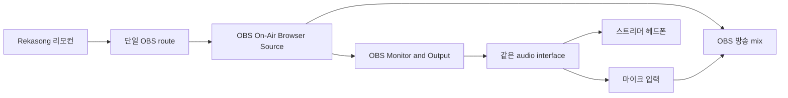

# OBS 노래 방송 performer-monitor 설계 — 2026-07-22

> 목적: OBS로 보내는 MR, 스트리머가 실제 듣는 MR, 마이크가 방송에 들어가는 시간이 장시간 어긋나지 않게 설정·측정·복구한다.
>
> 최우선 원칙: **측정 실패나 상태 신호 지연은 이미 성립한 OBS 연결과 재생을 절대 끊지 않는다.**

## 1. 제품 결정

1. 실제 노래 방송에서는 물리 스피커로 MR을 틀어 마이크에 다시 넣지 않는다. 물리 스피커→마이크 연결은 이번 인수 측정에서 monitoring path 지연을 수치화하기 위한 loop일 뿐이다.
2. 실제 사용자는 헤드폰으로 MR을 듣는다. 가능하면 마이크 입력과 헤드폰 출력을 **같은 오디오 인터페이스의 audio clock**에 둔다.
3. MR의 방송 출력은 계속 OBS Browser Source 한 경로가 담당한다. performer monitor는 두 번째 방송 route나 두 번째 Worker lease가 아니다.
4. G2/G3/G4/G5/G6 증거는 서로 덮어쓰지 않는다. 특히 `OBS 플레이어 재생`, `믹서 입력`, `녹화 artifact`, `플랫폼 artifact`, `마이크↔MR 싱크`를 한 개의 “정상” 표시로 합치지 않는다.
5. G6의 `unknown`, `failed`, `stale`, `unavailable`은 안내 상태다. play/pause/seek/volume, established route, WebSocket 복구를 막지 않는다.
6. OBS Sync Offset은 자동 변경하지 않는다. 추천값을 제시하더라도 사용자가 적용한 뒤 같은 fixture로 다시 녹화해 통과해야 한다.
7. 실제 OBS streaming이 진행 중이거나 streaming 여부를 확인하지 못하면 점검 신호를 재생하지 않는다. 앱과 Worker는 OBS 방송 시작·종료 권한을 갖지 않는다.

### 1.1 30초 기준 갱신의 정확한 의미

- 실제 MR은 `HTMLMediaElement`와 출력 장치의 오디오 시계로 계속 재생한다. JavaScript timer나 Worker 시각이 오디오를 끌고 가지 않는다.
- 곡 시작, play, pause, buffering, seek 적용, ended, error는 즉시 보고한다. 아무 조작 없이 재생되는 동안의 절대 `position`만 30초마다 관측한다.
- Dashboard는 마지막 절대 위치와 단조 시계를 사용해 진행 표시를 로컬 보간한다. 30초 동안 숫자가 멈추지 않으며, 탭 timer가 늦어져도 누적 tick 수가 아니라 절대 경과시간으로 다시 계산한다.
- 30초 관측값과 예상 표시가 다르면 화면 기준만 다시 잡는다. 재생 중인 OBS media에는 자동 seek, restart, playback-rate 변경, route 교체 또는 reconnect를 보내지 않는다.
- 5분 곡은 시작·종료와 최대 9~10개의 주기 위치 관측만 필요하다. 각 곡의 새 `runId`와 `position: 0`이 다음 곡의 실제 재동기화 경계다.
- 이 방식은 Cloudflare 메시지를 줄이고 리모컨을 부드럽게 유지하지만, 서로 다른 물리 입력·출력 장치의 clock drift 자체를 보정하지는 않는다. 그 문제는 같은-clock performer 경로와 곡 단위 G6 측정으로 판정한다.

## 2. 2026-07-22 실측이 알려 준 것

현재 시험 장치는 온보드 `High Definition Audio` 스피커 출력과 별도 USB `FIFINE K670` 마이크 입력이다.

| 항목 | 결과 | 판정 |
|---|---:|---|
| 10분 marker | 60/60 | 통과 |
| MR 직접 시간축 | 590초에서 `+9.0ms` | 통과 |
| jitter p95 | `1.832ms` | 통과 |
| 시작·끝 구간 drift | `15.5ms` | 실패 (`≤10ms`) |
| 선형 drift | `17.32ms/590초` | 실패 (`≤10ms`) |
| 중앙 offset | `43.25ms` | 실패 (`±20ms`) |

같은 artifact를 endpoint-inclusive 31-marker/300초 rolling window로 다시 계산하면 edge drift 최악은 `9.753ms`였지만 linear-fit drift 최악은 `10.408ms`였다. 8kHz 교차 분석도 각각 `9.825ms`, `10.428ms`로 같았다. 따라서 5분 drift는 경계·재검 필요, fixed offset은 실패로 유지한다.

MR 재생 자체와 OBS media graph는 10분 동안 끊김·restart·seek 없이 유지됐다. 기존 10분 기준을 넘은 값은 연결 불안정이 아니라 서로 다른 출력·입력 하드웨어 clock을 지나는 현재 monitoring chain의 상대 drift다. 여기서 “시계가 늦어진다”는 말은 한 장치가 갑자기 멈춘다는 뜻이 아니다. 두 장치가 각각 48,000 sample을 1초라고 세는 실제 속도가 아주 조금 달라서, 처음의 작은 차이가 시간에 비례해 누적된다는 뜻이다.

제품의 실제 싱크 단위는 무한히 이어지는 한 재생기가 아니라 **한 곡**이다. OBS route와 player lease는 곡 사이에도 유지하지만, 각 곡은 새 `runId`와 `position: 0`으로 새 재생 기준점을 만든다. 이전 곡은 정확한 정지 증거 뒤에만 교체하며, 재생 중인 곡에는 telemetry·analyzer 결과를 이유로 자동 seek·restart·playback-rate 보정을 하지 않는다. 최대 곡 길이는 5분을 수용 창으로 사용하고, 10분 fixture는 drift 속도와 장시간 연속성을 알아보는 보수적인 스트레스 진단으로만 사용한다. 30초 cadence를 사용하더라도 위치 비교·기록만 수행하며, 보정은 다음 곡 시작 경계로 미룬다.

Browser Source에 `+69ms` Sync Offset을 적용한 비교에서는 마이크 상대 지연이 약 `82–84ms`로 더 커졌다. Sync Offset은 이 장치 간 drift의 해법이 아니므로 `0ms`로 복원했다.

## 3. 권장 실제 연결



권장 설정:

- OBS project sample rate: 48 kHz
- OBS Monitoring Device: 마이크와 같은 오디오 인터페이스의 헤드폰 출력
- On-Air Browser Source: `Monitor and Output`
- 마이크 source: 방송 output은 켜되 OBS monitoring은 끄거나, 인터페이스의 direct monitoring 사용
- 물리 스피커: 방송 중 OFF
- Browser Source Sync Offset: 측정 전 `0ms`, 측정 결과만 보고 수동 검토

USB 마이크처럼 헤드폰 출력이 없는 단독 장치를 계속 써야 한다면 `마이크 입력 장치 + PC 본체 출력`을 통과 판정으로 추측하지 않는다. 별도 저지연 performer-monitor 경로를 구성하고 동일한 10분 fixture로 실제 값을 다시 잰다.

## 4. 연결과 검증의 독립 상태

제품 상태는 다음 세 축으로 분리한다.

```text
broadcastRoute
  selected: speaker | obs
  confirmed: speaker | obs | unknown
  health: ready | playing | telemetry_delayed | source_hidden | recovery_required

performerMonitorDeclaration
  useCase: music | karaoke
  topology: unknown | same_clock_interface | separate_devices | direct_monitor
  sampleRate: unknown | 48000 | other
  changedAt

karaokeSyncEvidence
  status: unknown | running | passed | failed | stale | unavailable
  fixedOffsetMs
  driftMs
  jitterP95Ms
  markerCount / expectedMarkerCount
  dropoutCount / echoSecondaryPeak
  artifactHash / fixtureVersion / analyzerVersion
  obsProfile / sceneCollection / monitorDeviceFingerprint
  checkedAt
```

절대 불변식:

- `karaokeSyncEvidence.status`는 `broadcastRoute`를 변경하지 않는다.
- evidence 저장·읽기 실패는 곡을 멈추거나 output lease를 바꾸지 않는다.
- 장비·profile·sample rate·monitoring·track·Sync Offset 변경은 evidence를 `stale`로만 만든다.
- `failed`는 숨기지 않고 실패 수치와 **다음 행동**을 보여 준다.
- `passed`도 실제 플랫폼 artifact G5를 대신하지 않는다.

## 5. 설정 UI

메인 헤더는 기존 결정대로 `ON AIR / 현재 출력 / 톱니`만 유지한다. 노래 방송 설정은 톱니 안에 둔다.

### 5.1 현재 구현 slice

- `노래 방송 모니터 경로`를 접힌 한 줄로 둔다.
- 펼치면 “물리 스피커는 측정용, 실제 방송은 헤드폰”, same-clock 권장, OBS monitoring 위치, 짧은 점검→10분 측정 순서를 보여 준다.
- 긴 설명은 기본적으로 접혀 있어 음악 감상과 일반 음악 방송 사용자를 방해하지 않는다.
- 모든 문구는 한국어·영어 semantic key로 제공한다.

### 5.2 다음 UI slice

상태명보다 다음 행동을 앞에 둔다.

| evidence | 첫 문장/행동 | 보조 정보 |
|---|---|---|
| unknown | `헤드폰 경로를 설정하고 10분 싱크를 점검하세요` | 마지막 결과 없음 |
| separate_devices | `마이크와 헤드폰을 같은 오디오 장치로 맞추세요` | 장치 간 drift 위험 |
| running | `녹화를 유지하고 곡을 조작하지 마세요` | marker 진행률 |
| failed drift | `같은 clock 경로로 바꾼 뒤 다시 측정하세요` | drift·jitter·offset 수치 |
| failed offset | `모니터 경로를 확인하고 수동 보정 뒤 재측정하세요` | 자동 offset 변경 없음 |
| stale | `설정이 바뀌었습니다. 같은 fixture로 다시 점검하세요` | 무엇이 달라졌는지 |
| passed | `노래 방송용 모니터 경로를 확인했습니다` | 날짜·fingerprint·수치 |

실패 카드에도 `계속 재생 가능`을 명시한다. 긴급 정지나 완전 초기화는 sync 카드에 두지 않는다.

## 6. 점검 신호의 방송 유입 방지

점검 신호 시작은 세 군데에서 독립적으로 거부한다.

1. Dashboard UI: 정확한 OBS player가 보고한 `streamingStatusObserved=true`와 `streaming=false`일 때만 버튼 활성.
2. Coordinator·Worker: command 생성 전과 relay 전에 같은 조건을 다시 확인. active/unknown이면 durable test 상태를 만들거나 player로 보내지 않음.
3. OBS player: 실제 fixture LOAD 전과 PLAY 직전에 runtime을 다시 확인. streaming 시작 event가 fixture 중 도착하면 fixture만 strong stop.

이 보호는 일반 MR 재생에는 적용하지 않는다. 사용자가 OBS 방송 중 MR을 재생하는 것은 제품의 본래 목적이며, streaming telemetry가 일반 곡을 끊는 kill switch가 되어서는 안 된다.

## 7. 곡 단위 analyzer·certificate 구현

분석기는 앱의 첫 화면 bundle에 넣지 않는다. 사용자가 G6 점검을 열거나 녹화 artifact를 선택할 때만 dynamic import한다.

처리 순서:

1. 48 kHz로 각 track decode/resample
2. MR 직접 track에서 5분 제품 시험의 endpoint-inclusive 31개 marker 또는 10분 스트레스 시험의 60개 cycle 검출
3. mic/monitor track에서 같은 880/440 Hz marker 검출
4. cycle별 cross-correlation과 440 Hz edge를 독립 계산
5. fixed offset, 선형 drift, 첫 5↔마지막 5 중앙값 drift, detrended jitter p95 계산
6. 누락·중복·dropout·secondary echo peak 검사
7. 원본 artifact hash와 설정 fingerprint를 포함한 local certificate 저장

원본 녹화 파일은 서버로 자동 업로드하지 않는다. 결과 JSON만 사용자가 명시적으로 내보낼 수 있게 한다.

## 8. 수용 기준

| 항목 | 기준 |
|---|---:|
| 5분 marker | 31/31 (`0..300초`), 누락·중복 0 |
| 보정 후 fixed offset | `±20ms` 이내 |
| 한 곡(최대 5분) relative drift | `≤10ms` |
| jitter p95 | `≤5ms` |
| active dropout | 0 |
| echo secondary peak | 정책 한계 이하 |
| 반복성 | 5분 본시험 뒤 짧은 시험 1회 추가 통과 |
| 10분 stress | 진단값으로 기록하되 route·재생 차단 조건으로 사용하지 않음 |

통과하더라도 장비 fingerprint가 바뀌면 `stale`로 내리고 재검을 안내한다. 시간 경과만으로 매 방송마다 강제 재검하지 않는다.

## 9. 성능·네트워크 예산

- Speaker 유휴·검색·로컬 재생에는 이 기능으로 인한 Worker session, WebSocket, heartbeat가 0개여야 한다.
- OBS heartbeat cadence는 현재 10초를 유지한다. streaming 상태 필드 추가 때문에 주기를 늘리지 않는다.
- streaming 시작/종료 callback은 상태 변경 때만 storage-free heartbeat 한 번을 보낸다.
- audio sample이나 meter 값을 Worker로 연속 전송하지 않는다.
- analyzer는 별도 lazy chunk, 분석 중 UI frame budget과 메모리 상한을 측정한다.
- certificate는 bounded JSON이며 오디오 원본·stream key·OBS password를 포함하지 않는다.

## 10. 실행 순서

1. 완료: 10분 물리 분리 track을 측정해 MR 연속성과 현재 장치의 장시간 drift를 수치화하고, 31-marker/300초 rolling window로 재분석했다. 5분 edge 통계는 통과했지만 linear-fit이 약 `0.4ms` 초과해 경계·재검 필요로 유지한다.
2. 구현: streaming active/unknown일 때 점검 신호를 UI·Coordinator·Worker·OBS player에서 차단한다.
3. 구현: 설정 안에 접힌 performer-monitor 연결 안내를 추가한다.
4. 다음: G6 certificate schema와 artifact import/analyzer를 lazy module로 만든다.
5. 다음: 같은 audio clock 장치 또는 저지연 performer-monitor 경로로 5분 곡 단위 시험+짧은 반복 시험을 실행한다. 10분 run은 선택적인 stress 자료로 별도 기록한다.
6. 별도: scene 전환·source refresh·OBS 재시작 변형을 검증한다.
7. 별도: 사용자가 명시적으로 비공개 송출을 승인한 경우에만 G5를 수행한다.
