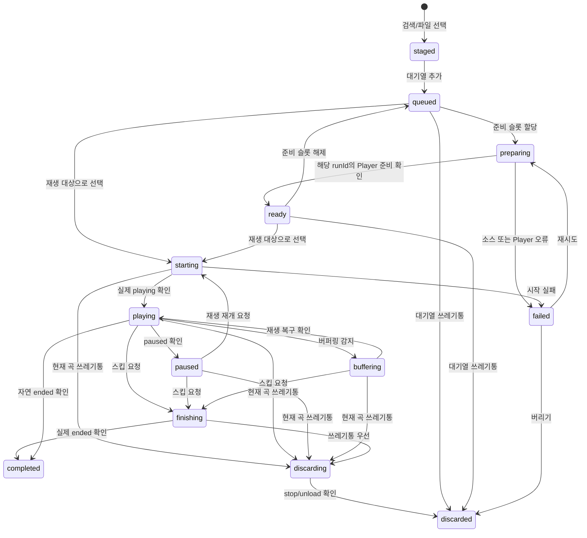

# Rekasong 곡 생애주기와 상태 모델

> 기준일: 2026-07-16
> 상태: **프로젝트의 규범적 설계 기준**

이 문서는 Rekasong에서 곡 하나를 검색·대기열 추가·준비·재생·종료하는 전 과정을 정의한다. 앞으로 재생 로직, Worker/OBS 동기화, 위젯, 대기열, 오류 처리, UI/UX 판단은 이 문서를 기준으로 해석한다.

과거 UX 감사 문서는 당시 구현의 관찰 기록이다. 이 문서와 충돌할 경우에는 이 문서의 상태 모델을 우선한다.

## 1. 핵심 결정

상태의 단위는 카탈로그의 `곡`이 아니라 **이번 방송에서 한 번 재생하려고 대기열에 넣은 곡 인스턴스**다.

```text
SongDefinition  = 카탈로그의 곡/출처 자체
QueueEntry      = 이번 방송 대기열에 들어온 한 건
PlaybackRun     = QueueEntry를 실제 플레이어에 올린 한 번의 시도
```

- `entryId`는 QueueEntry가 생성될 때 발급하며, 그 항목이 완료·폐기될 때까지 바뀌지 않는다.
- `runId`는 실제 재생을 시작·재시도·재시작할 때마다 발급한다.
- Player 이벤트는 최소 `entryId`, `runId`, `playerInstanceId`를 포함한다. 이전 iframe·미디어 요소의 늦은 이벤트는 현재 run과 정확히 일치하지 않으면 폐기한다.
- 같은 곡을 다시 부르기는 기존 항목을 되살리는 일이 아니라 새 `QueueEntry`를 만드는 일이다.

## 1-1. UI/UX의 새 정의

Rekasong에서 UI의 명시성과 친절함은 설명문이나 버튼 수의 문제가 아니다. **사용자가 곡의 생애주기 전이를 혼란 없이 인식하고, 다음 행동을 안전하게 선택할 수 있게 하는 것**으로 정의한다.

따라서 모든 곡 관련 화면과 상호작용은 아래 다섯 질문에 즉시 답해야 한다.

| 사용자가 알아야 할 것 | UI가 제공해야 하는 답 |
|---|---|
| 지금 어디에 있는가? | 현재 `phase`를 사람이 이해할 말과 상태 배지로 표시한다. |
| 방금 누른 행동은 무엇을 시도하는가? | `준비 중`, `스킵 중`, `취소 중`처럼 요청과 확인 대기를 숨기지 않는다. |
| 다음에는 무엇이 일어나는가? | 자동 다음 곡·대기·재시도처럼 예정된 전이를 짧게 설명한다. |
| 왜 지금 할 수 없거나 멈췄는가? | Player 미연결, MR 오류, 광고/출력 안전성 미확인 등 구체적 이유와 회복 행동을 보인다. |
| 이 행동의 결과는 무엇인가? | 이력 추가 여부, 자동 다음 곡 여부, 폐기 여부처럼 되돌리기 어려운 결과를 미리 알린다. |

즉, UI는 제어 버튼의 집합이 아니라 **생애주기 상태를 읽고 전이시키는 인터페이스**다. 상태가 바뀌기 전에는 화면도 그 결과를 단정하지 않는다.

## 2. 서로 섞으면 안 되는 네 가지 정보

곡에 관련된 모든 정보를 하나의 `status` 문자열로 합치지 않는다. UI에서 보여 줄 중심 상태는 아래 2-1의 `phase` 하나이며, 나머지는 별도 배지·설명으로 보인다.

### 2-1. 생애주기 상태 (`phase`)

`phase`는 QueueEntry가 지금 생애주기의 어디에 있는지를 나타내는 유일한 중심 상태다.

| phase | 의미 | 기본 표시 |
|---|---|---|
| `staged` | 검색/파일 선택 뒤, 아직 대기열에 넣지 않음 | 곡 정보 확인 |
| `queued` | 대기열에 있으나 아직 실제 플레이어에 할당하지 않음 | 대기 |
| `preparing` | 준비 요청을 보냈고 Player 확인을 기다림 | 준비 중 |
| `ready` | 정확한 run의 미디어가 실제 Player에서 재생 가능함 | 준비됨 |
| `starting` | 재생 요청을 보냈고 실제 재생 확인을 기다림 | 재생 시작 중 |
| `playing` | Player가 실제 `playing`을 회신함 | 재생 중 |
| `paused` | Player가 실제 `paused`를 회신함 | 일시정지 |
| `buffering` | 재생이 멈춰 복구를 기다림 | 버퍼링 |
| `finishing` | 스킵으로 끝 지점으로 보낸 뒤 실제 `ended`를 기다림 | 스킵 중 |
| `discarding` | 쓰레기통으로 stop/unload를 요청한 뒤 확인을 기다림 | 취소 중 |
| `failed` | 준비·재생·복구가 실패함 | 재생 실패 |
| `completed` | 자연 종료 또는 스킵으로 정상 종료됨 | 이전 재생 |
| `discarded` | 사용자가 명시적으로 버림 | 목록에서 제거 |
| `abandoned` | 방송 세션 종료·임시 파일 만료로 더 이상 복구하지 않음 | 목록에서 제거 |

### 2-2. MR/출처 상태 (`sourceStatus`)

이 값은 카탈로그와 캐시의 정보다. `available`은 출처가 있다는 뜻일 뿐, 지금 방송에서 재생 준비가 끝났다는 뜻이 아니다.

| sourceStatus | 의미 |
|---|---|
| `unknown` | 아직 출처를 확인하지 않음 |
| `checking` | URL·파일·임베드 가능 여부를 확인 중 |
| `available` | 유효한 MR 후보가 확인됨 |
| `unavailable` | 삭제·비공개·권한·형식 문제로 재생 불가 |
| `stale` | 과거 확인 결과가 오래되어 재검증 필요 |

### 2-3. 실제 Player 연결 상태

다음 값은 곡 `phase`가 아니라 세션의 상태다.

```text
controllerConnection = disconnected | connecting | connected | reconnecting
playerConnection     = absent | connected | stale | reconnecting
sessionStatus         = waiting_for_player | active | ending | ended
```

리모컨 WebSocket이 연결됐다고 해서 OBS Player가 연결된 것은 아니다. UI에서 “OBS 플레이어 연결됨”은 반드시 실제 Player lease/heartbeat를 의미해야 한다.

### 2-4. YouTube의 출력 안전성

YouTube iframe의 `onReady`는 iframe이 만들어졌다는 뜻일 뿐, 광고 없이 실제 곡의 타임라인이 준비됐다는 뜻이 아니다.

```text
embedStatus  = unavailable | created | loaded
outputSafety = unknown | safe | blocked
```

광고와 실제 곡을 신뢰성 있게 구분할 수 없는 동안에는 `outputSafety: unknown`이다. 이 경우 UI는 `준비됨`이라고 단정하지 않는다.

## 3. 표준 생애주기 그래프



방송 세션이 종료되면 `staged`를 제외한 비종료 항목은 `abandoned`로 전이한다. 방송 UI에서는 이 항목들을 지우며, 임시 로컬 파일 참조도 함께 폐기한다. 제목 캐시·노래책 MR 매핑 같은 카탈로그 캐시는 유지한다.

## 4. 사용자 동작의 정확한 정의

### 4-1. 대기열 추가와 준비

1. 사용자가 스테이징의 **대기열 추가**를 누르면 `staged → queued`가 된다.
2. 스케줄러가 준비 슬롯을 배정하면 `queued → preparing`이 된다.
3. 실제 Player가 해당 `entryId + runId`의 미디어를 준비했다고 확인해야 `ready`가 된다.
4. MR 캐시가 있거나 URL이 존재하는 것만으로는 `ready`가 되지 않는다. 이것은 `sourceStatus: available`일 뿐이다.

단일 OBS Player만 있는 현재 구조에서는 실제로 로드한 한 곡만 `ready`가 될 수 있다. 여러 대기곡을 준비됨으로 표시하려면 별도의 음소거 preload 슬롯/플레이어 풀이 필요하다.

### 4-2. 재생 시작·일시정지·탐색

| 의도 | 상태 전이 | 확정 기준 |
|---|---|---|
| 현재 곡으로 선택 | `queued/ready → starting` | Worker가 run을 만들고 Player에 로드 요청 |
| 재생 시작/재개 | `starting → playing` | Player의 실제 `playing` 이벤트 |
| 일시정지 | `playing → paused` | Player의 실제 `paused` 이벤트 |
| 일반 탐색 | `playing/paused → 같은 상태` | 해당 run의 seek 적용 확인 |
| 다시 시작 | `playing/paused → starting → playing/paused @ 0초` | 0초 이동 확인 |

다시 시작은 재예약이 아니다. 재생 중이면 0초부터 계속 재생하고, 일시정지 중이면 0초에서 일시정지 상태를 유지한다. 이력과 대기열은 바꾸지 않는다.

### 4-3. 스킵

스킵은 삭제나 다음 곡 직접 로드가 아니다.

```text
playing | paused | buffering
  → finishing { completionReason: "skipped" }
  → Player가 현재 콘텐츠의 끝으로 이동
  → 동일 runId의 실제 ended 확인
  → completed
```

- `completed`가 된 뒤에만 이력에 추가한다.
- 자동 다음 곡은 이 전이 뒤에만 실행한다.
- 길이를 모르거나 Player가 아직 준비되지 않았으면 스킵으로 완료 처리하지 않는다.
- `finishing` 중에는 일반 재생·일시정지·재시작을 막고, 쓰레기통만 허용한다.

일반 `seek` 명령을 스킵에 재사용하지 않는다. Player가 자신의 실제 미디어 길이를 바탕으로 처리하고 `ended`를 돌려주는 별도 `finish` 명령이 필요하다.

### 4-4. 현재 곡 쓰레기통

현재 곡 쓰레기통은 정상 종료와 완전히 다른 전이다.

```text
active phase
  → discarding { reason: "user_discard" }
  → Player의 stop + unload 확인
  → discarded
```

- 명령은 즉시 보낸다. 다만 실제 정지가 확인되기 전에는 화면에서 조용히 지우지 않고 `취소 중`으로 보인다.
- `discarded`는 이력에 남기지 않는다.
- `discarded` 뒤에는 자동 다음 곡을 시작하지 않는다.
- 취소 중 늦게 도착한 `ended`는 무시한다. `discard` 의도가 항상 우선한다.
- 대기열 행의 쓰레기통은 Player와 무관하므로 즉시 `queued → discarded`가 된다.

### 4-5. 실패·재시도·재분석

`failed`는 정상 종료가 아니다. 이력과 자동 다음 곡을 발생시키지 않는다.

| 상황 | 전이 | 제공할 행동 |
|---|---|---|
| MR/임베드 확인 실패 | `preparing → failed` | 재검사, MR 재탐색, 파일 업로드, 버리기 |
| 현재 재생 오류 | `starting/playing/buffering → failed` | 재시도, 대기열로 돌리기, 버리기 |
| AI 제목 분석 실패 | `phase`는 유지 | 제목 직접 수정, 다시 분석 |

AI 제목 정리와 MR 재탐색은 카탈로그/출처의 상태를 바꾸는 일이다. 대기열의 곡 생애주기를 임의로 완료·폐기하지 않는다.

### 4-6. 바로 재생·자동 다음 곡·다시 부르기

| 동작 | 정의 |
|---|---|
| 대기열 곡 바로 재생 — 현재 곡 없음 | 선택 항목을 `starting`으로 승격 |
| 대기열 곡 바로 재생 — 현재 곡 있음 | 선택 항목을 다음 전환 대상으로 예약하고 현재 곡에 스킵 요청 |
| 자동 다음 곡 | 오직 `completed` 뒤에만 큐 순서대로 실행 |
| 현재 곡을 버린 뒤 | 다음 곡을 자동 실행하지 않음 |
| 이전 재생 곡 다시 부르기 | 기존 완료 항목을 되돌리지 않고 새 `entryId`로 `queued` 생성 |

현재 곡을 버리고 특정 곡을 곧바로 틀고 싶다면, 그것은 `현재 곡 폐기 + 선택 곡 시작`이라는 별도 복합 명령으로 설계한다. “바로 재생”이 몰래 현재 곡을 이력 처리해서는 안 된다.

### 4-7. 방송 세션 종료와 비상 정지

비상 정지는 곡 단위 Status가 아니다. 향후 필요하다면 **방송 세션 전체 중단**이라는 별도 시스템 명령으로만 정의한다.

- 현 UI에서는 비상 정지를 비노출로 둔다.
- OBS 설정의 **방송 세션 종료**는 정상 종료·스킵·쓰레기통과 다르다.
- 세션 종료가 확정되면 현재 곡·대기열·이전 재생 목록·임시 파일 참조를 함께 정리한다.

## 5. 생애주기를 드러내는 UI/UX 원칙

이 상태 모델은 데이터 설계뿐 아니라 UI의 행동 기준이다. 모든 명령은 아래 순서로 보인다.

```text
현재 상태 표시 → 사용자 의도 입력 → 전이 중 상태 표시 → Player 확인 → 확정 결과 표시 → 다음 안전한 행동 제시
```

전이 중 상태를 건너뛰면 사용자는 버튼을 눌렀을 때 실제 방송에 무엇이 일어났는지 알 수 없다. 따라서 짧은 전이라도 `starting`, `finishing`, `discarding`을 시각적으로 구분한다.

| phase | UI가 분명히 보여야 할 것 | UI가 하면 안 되는 일 |
|---|---|---|
| `queued` | 대기 순서와 MR 연결/검증 여부 | URL이 있다는 이유만으로 준비됨 표시 |
| `preparing` | 어느 Player가 무엇을 준비 중인지, 기다리는 이유 | 준비 완료처럼 재생·스킵 허용 |
| `ready` | 지금 즉시 시작 가능한 대상임 | 단순 캐시 결과와 동일하게 표현 |
| `starting` | 재생 요청 후 실제 시작을 확인 중임 | 이미 재생 중이라고 위젯·현재 곡을 확정 |
| `finishing` | 스킵으로 끝을 확인 중이며, ended 뒤에만 다음 곡으로 감 | 즉시 다음 곡으로 화면을 교체 |
| `discarding` | 현재 곡을 멈추고 버리는 중이며 자동 다음 곡은 없음 | 실제 정지 확인 전 제목을 조용히 제거 |
| `failed` | 실패 원인과 재시도·재탐색·파일 업로드·버리기 | 실패 곡을 완료 이력에 넣거나 몰래 건너뛰기 |
| `completed` | 정상 종료/스킵 종료와 다음 곡 정책 | 폐기와 같은 결과로 취급 |

1. **상태를 추측해 보이지 않는다.** `재생 중`, `준비됨`, `OBS 플레이어 연결됨`은 각각 해당 확인 이벤트 뒤에만 보인다.
2. **명령 중인 곡을 숨기지 않는다.** `finishing`, `discarding`, `starting`은 짧더라도 사용자에게 보여야 한다.
3. **상태별로 가능한 행동만 노출한다.**
   - `finishing`: 쓰레기통만 허용
   - `discarding`: 중복 조작을 막고 취소 확인 상태를 표시
   - `failed`: 재시도·재탐색·파일 업로드·버리기만 제시
4. **MR 연결됨과 준비됨을 구분한다.** 카탈로그는 MR 연결/검증 정보를, 현재 재생·대기열은 runtime phase를 보여 준다.
5. **현재 재생은 실제로 활성인 run만 표시한다.** 시작 중·취소 중에는 제목을 유지하고 상태를 표시한다. 완료·폐기 확인 전에는 다음 곡으로 밀어내지 않는다.
6. **대기열 순서를 조용히 바꾸지 않는다.** 자동 다음 곡과 바로 재생 모두 전이 대상과 이유를 표시한다.
7. **화면정보 위젯도 같은 확정 상태를 사용한다.** 대시보드의 낙관적 React 상태가 아니라 Worker의 확정 projection을 표시한다.

## 6. 이벤트·동기화 계약

상태를 바꾸는 순서는 항상 아래와 같다.

```text
Dashboard: 의도 명령 전송
  → Worker: 요청과 현재 run을 검증하고 명령 전달
    → OBS Player: 실제 미디어 조작
      → Worker: runId가 일치하는 확인 이벤트 수신
        → Worker: 상태 확정 및 대시보드/위젯에 동일 projection 발행
```

### 6-1. Controller 명령

```text
enqueue | prepare | activate | play | pause | seek | restart
finish | discard | retry | remove_queue_item | end_session
```

### 6-2. Player 확인 이벤트

```text
ready | playing | paused | buffering | position | ended
discarded | failed | player_presence
```

Worker는 모든 확인 이벤트에 대해 `entryId + runId + playerInstanceId`가 현재 값과 일치하는지 확인한다. 불일치하는 이벤트와 세션이 끝난 뒤의 이벤트는 상태를 바꾸지 않는다.

명령 수신 확인은 “Worker가 받았다”는 뜻일 뿐, 실제 재생·정지 확인이 아니다. `playing`, `completed`, `discarded` 같은 확정 상태는 반드시 Player 확인 이벤트로만 만든다.

## 7. 반드시 지켜야 할 불변식

1. 한 세션에는 `active` QueueEntry가 최대 하나다.
2. `completed`는 같은 `runId`에 대해 한 번만 발생하며, 실제 `ended` 뒤에만 발생한다.
3. `discarded`는 이력·자동 다음 곡·정상 종료 신호를 절대 발생시키지 않는다.
4. 자동 다음 곡은 `completed` 전이 하나에서만 실행한다.
5. UI는 명령을 보냈다는 이유만으로 재생·완료·폐기를 확정하지 않는다.
6. `ready`는 실제 Player 확인 후에만 표시한다. 캐시·URL·iframe 생성만으로는 충분하지 않다.
7. Player 연결 상실은 `completed`나 `discarded`가 아니다. 세션 종료가 확정될 때만 `abandoned`로 정리한다.
8. 세션 종료 시 임시 파일과 그 파일을 참조하는 대기열/이력 항목을 함께 제거한다.
9. 화면정보 위젯은 실제 방송 출력의 확정 상태만 표시한다.

## 8. 구현 우선순위

1. Worker가 `QueueEntry`, `PlaybackRun`, 단일 활성 run, Player lease를 소유하도록 만든다.
2. Player에 `prepare`, `finish`, `discard`, `restart`와 각각의 확인 이벤트를 구현한다.
3. 대시보드와 위젯을 Worker의 확정 projection만 렌더하도록 바꾼다.
4. 대기열·현재 재생 UI를 `phase`별 행동과 상태 문구로 바꾼다.
5. MR 캐시·AI 제목·노래책 UI를 `sourceStatus`와 `phase`의 구분에 맞춰 정리한다.

이 순서를 건너뛰고 버튼만 먼저 고치면, 화면과 OBS 출력이 다시 다른 상태를 가리킬 수 있다.
